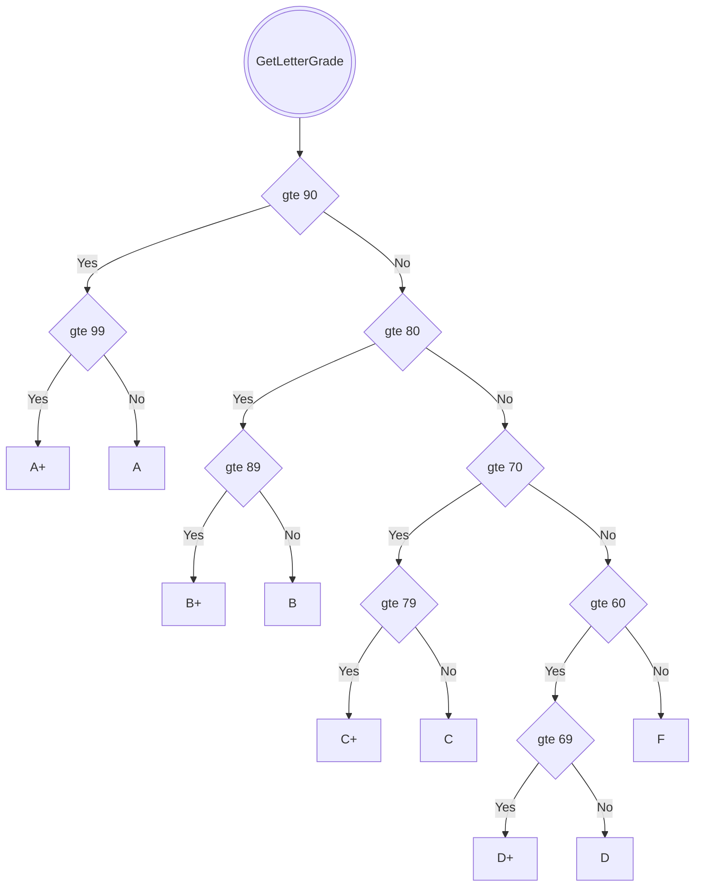

# Test Coverage Demo

## To Execute

1. Open a Terminal to the TestCoverageUnitTests directory.
2. Execute `dotnet test`.

## Graph of GradeLetterGenerator

```mermaid
flowchart TD
    start(((GetLetterGrade))) --> isA

    isA{gte 90} --> |Yes| whichA{gte 99}
    isA --> |No| isB{gte 80}
    whichA --> |Yes| Aplus[A+]
    whichA --> |No| A[A]

    isB{gte 80} --> |Yes| whichB{gte 89}
    isB --> |No| isC[gte 70]
    whichB --> |Yes| Bplus[B+]
    whichB --> |No| B[B]

    isC{gte 70} --> |Yes| whichC{gte 79}
    isC --> |No| isD[gte 60]
    whichC --> |Yes| Cplus[C+]
    whichC --> |No| C[C]

    isD{gte 60} --> |Yes| whichD{gte 69}
    isD --> |No| F[F]
    whichD --> |Yes| Dplus[D+]
    whichD --> |No| D[D]

```