# Homework 1

This first exercise is to get you accustomed to writing simple unit tests in the language of your choice and committing your code to your GitHub repo. This exercise is not graded. This exercise will help you prepare your environment for the semester project. 

**NOT GRADED! WHY SHOULD I BOTHER?**

You must learn how to do the work. Therefore, the work is its own reward. Also, this work will prepare you for the project and that is 50% of your grade. If you do not do the homework, you will struggle to complete the project.

You must become proficient at these topics to be competitive in the industry. If you want to find work quickly after graduation, you must be technically proficient. Grades without the skills to back them up mean nothing in the real world.

## Parts

The homework has two parts:

- Configure and use Git and GitHub
  *Source control is an essential software engineering skill. We will make use of `git`* and GitHub all semester.
- Write a small unit test in the language of your choice, then commit it to `git` and push the commit to GitHub.

## Optional

The final section is optional. It has some extra exercises I recommend if you have time. It covers how to clone your repo using the command line tools and how to run your unit tests from the command line. Developing proficiency using the command line is both instructive and helps differentiate you from less skilled developers who are entirely reliant on an IDE or graphical tool.

## Written Homework 1 from Prior Semesters

I have also provided the original written Homework 1 from prior semesters. We will discuss this in class. This material is useful for preparing for the midterm. I encourage you to review it and give it a try.

## Part 1: Git and GitHub

#### Watch a Few Short Videos

1. What is the difference in `git` and GitHub?

   https://www.youtube.com/watch?v=arr1YVqrd7o

2. How to push code to GitHub

   https://www.youtube.com/watch?v=wrb7Gge9yoE

3. Create Repository, Commit, and Push using GitHub Desktop

   https://www.youtube.com/watch?v=PvUexC0-D2s

Do not worry if some of these videos confuse yo. You will get a feel for this as you actually try it. Never forget that you *cannot* learn these techniques by just watching a video or reading. You must *do* these techniques to become proficient.

#### Create Github Account and Homework Repository

1. You need a Github account. If you do not have one, create a free account. One day you will likely share your GitHub portfolio with a client or portfolio, so avoid saying "ksu" or "student" or anything you might find embarrassing in your profile name.
   https://github.com/join

2. Next, you need a repository for your course homework. Create a new repository in your Github account called **swe3643-fall2024-homework**. 

   - Make the repository public.
   - Check the box to make a `README` file.
   - Use the Add Gitignore dropdown to select a `.gitignore` file for the language you choose to use. We will learn more about `.gitignore` later. Just choose one related to your preferred language you plan to use this semester. Your choices are:
     - **Java** - **java**
     - **C#** - **visualstudio** (curious they call it this rather than csharp or dotnet)
     - **Python** - **python*
   - Ignore choosing a license.

   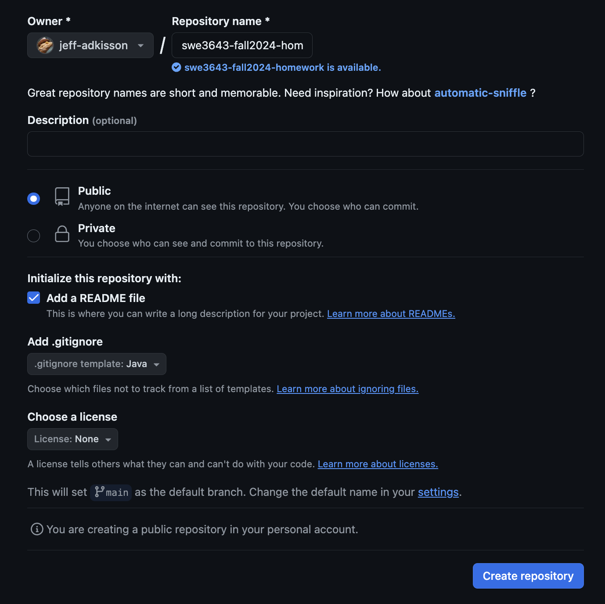

After creating the repository, it will contain two files - README.md and .gitignore. We will learn more about this later in the semester.

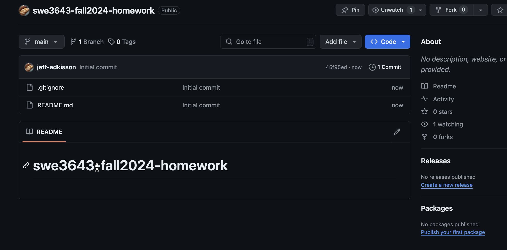

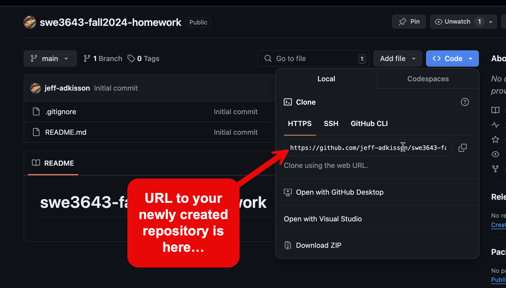

#### Install Git on Your Machine

1. You need the `git` source control tool installed on your machine. `git` is cross-platform, so it will work on Windows, Mac, and Linux. 
   https://git-scm.com/downloads
2. `git` is a command line tool. We will also install a graphical tool to help using it, but first, test the tool.
   1. Open a terminal window:
      - Windows (Command Prompt)
        https://www.wikihow.com/Open-the-Command-Prompt-in-Windows
      - Mac OS (Terminal)
        https://support.apple.com/en-kg/guide/terminal/apd5265185d-f365-44cb-8b09-71a064a42125/mac#:~:text=Terminal%20for%20me-,Open%20Terminal,%2C%20then%20double%2Dclick%20Terminal.
      - Linux
        This will be specific to your Linux distribution. Google for help if you cannot find your Terminal.
   2. From your command line, type `git --version`. Assuming `git` is properly installed, you will see something like the following:
      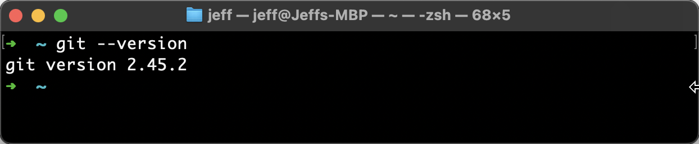
3. Finally, install a `git` graphical utility. I recommend Github Desktop or GitKraken.
   - Github Desktop
     From Github, free, cross-platform
     https://desktop.github.com/download/
   - Gitkraken
     Free edition available, I used the paid edition in my day job
     https://www.gitkraken.com/download
     *Note: These instructions do not cover Gitkraken. If you want to use it, the procedure is similar, but not identical. Watch some videos. I prefer Gitkraken to GitHub Desktop, but it is not quite as simple for beginners. Use Github Desktop if you have zero experience with git.*
     *Note 2: You can also commit and manage your repository via Rider, Intellij, etc. I am not a big fan of that approach either (personal preference), but you are welcome to do that if you want to learn it.*
   
4. Open GitHub Desktop and log in to Github. After you log in to Github, you will be able to locate the homework repository you created in the prior section.

   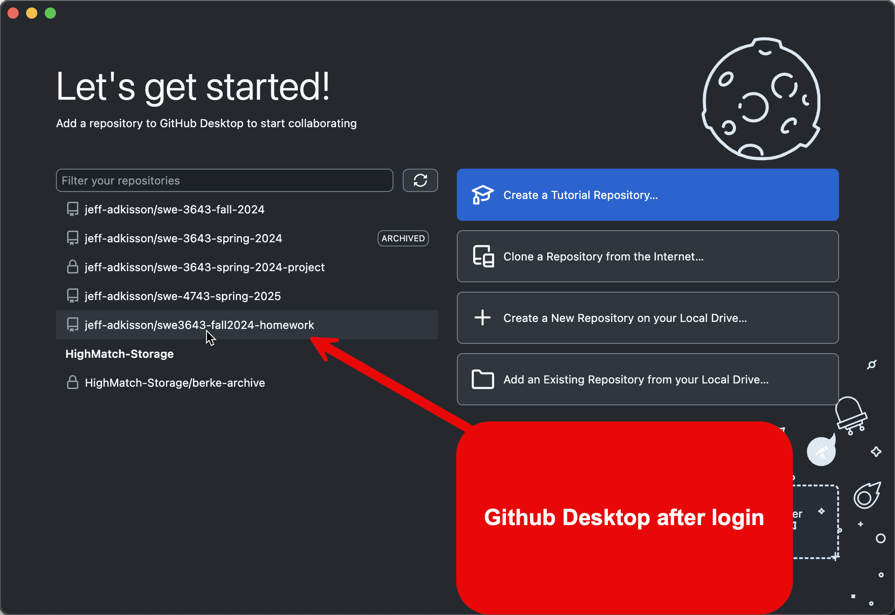

5. Choose where to place the local copy of the repository on your machine, then clone the repository. Cloning makes a copy of the remote repository hosted by GitHub available on your machine for local work.
   *Note: the URL to the repository will be YOUR GitHub repository. The examples show the URL I made for this document. Do not use the values below.*

   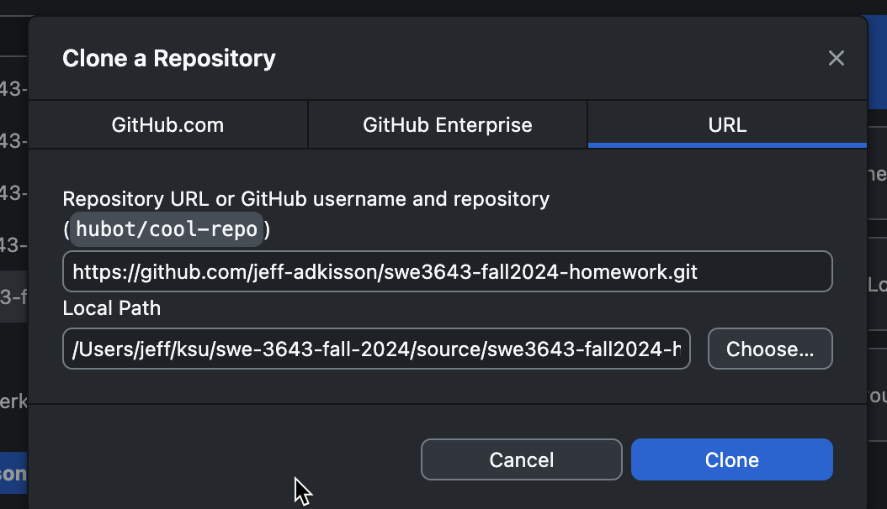

6. Once you have cloned your repository, it is on your machine and ready for you to add code. You can open the directory in Finder/Explorer:
   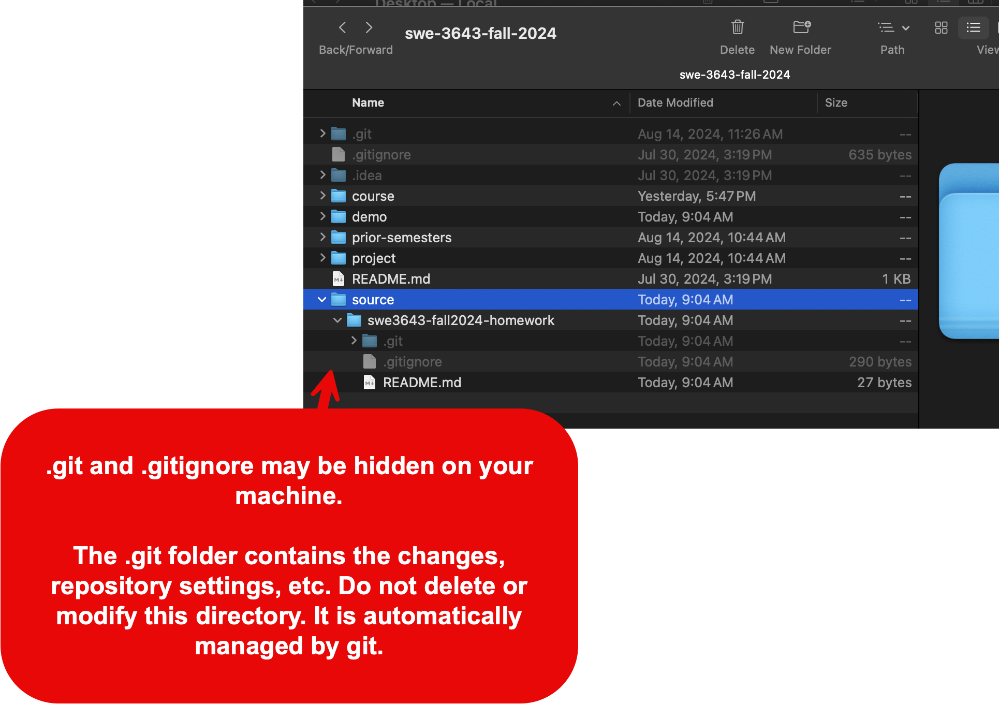

#### Push Your First Commit to your GitHub Repository

Next, you will update a single file, commit it to the local GitHub repository, and then push the change to the public GitHub repository.

1. Find the local version of your homework repository using Explorer/Finder.

2. Right-click on the **README.md** file and open it in Notepad (Windows) or TextEdit (Mac).

   This file contains Markdown, a friendly language for writing well-formatted documentation. Markdown is an industry-standard method for writing documentation.
   https://www.markdownguide.org/basic-syntax/

3. In your text editor, change the file to the following:

   ```
   # Fall 2024 SWE 3643 Testing and QA Homework
   ## put your name here
   
   - Homework 1: Create a git repo and a simple unit test.
   ```

​	This is Markdown. When rendered in a Markdown viewer (such as GitHub), it will look similar to this:

> # Fall 2024 SWE 3643 Testing and QA Homework
> ## Jeff Adkisson
>
> - Homework 1: Create a git repo and a simple unit test.

4. Save the file.
5. If you are on an Apple Mac, edit the `.gitignore` file as well. Add `.DS_Store` to a new line at the end of the file. This will tell `git` to ignore this file used by the operating system that you do not ever need checked in. This is not absolutely necessary, but it helps keep your repository clean. Clean and tidy code is easier to read and maintain.
6. Switch to Github Desktop or GitKraken. You will now see it has detected that README.md has changed.
   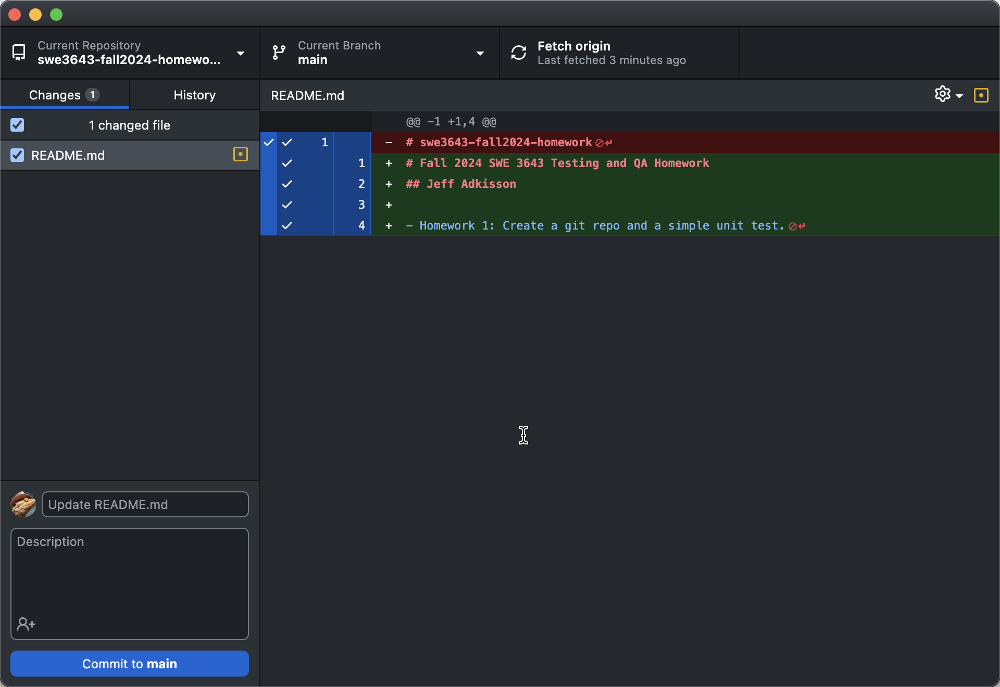

7. Type a commit message briefly summarizing your changes, then click **Commit to main**. Writing good commit messages helps other people (and you) understand what changed. 
   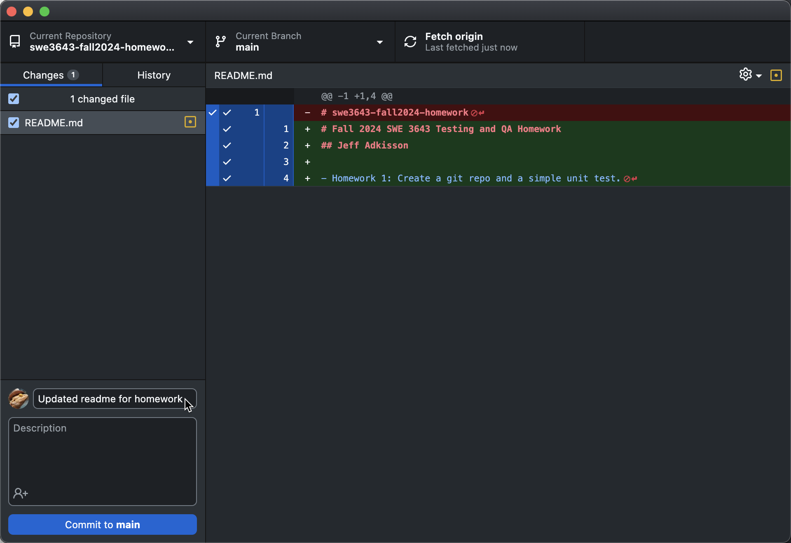
8. Next, send your changes to the repository hosted by GitHub. This is called pushing your changes to the origin (or remote). If you do not push your changes, they are not visible to other people using the repository hosted by GitHub. I like to push my changes routinely even when working alone to ensure I always have a copy of my work stored on both my machine and in the cloud.
   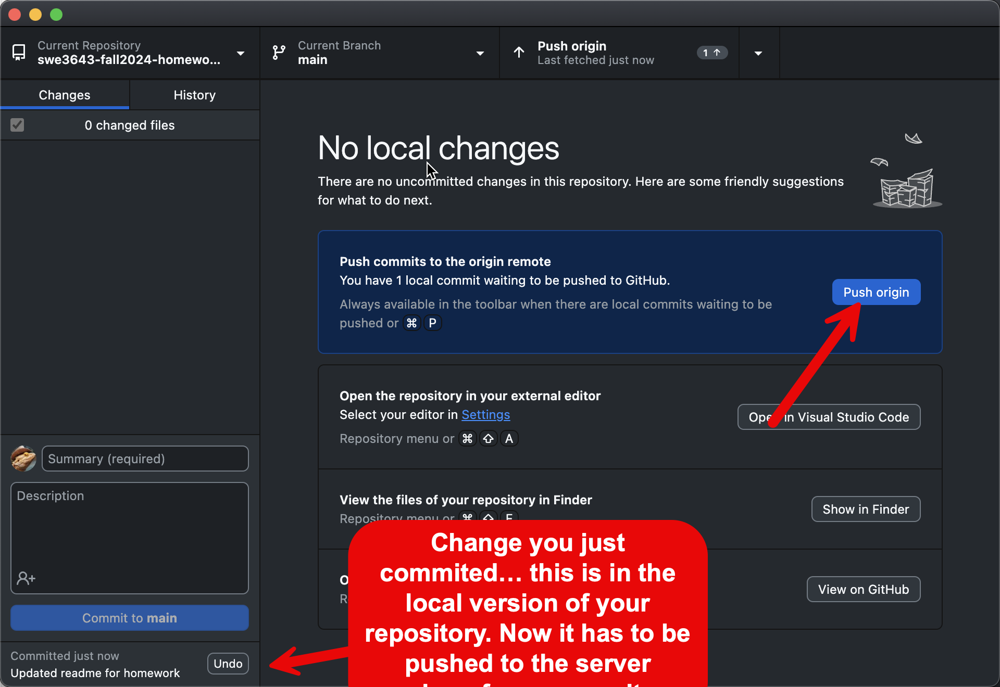

8. After pushing your changes, click the History tab. You can look at the commits to your repository. The commits show each change made. Note the Initial commit was made by GitHub when you made the remote repository.
   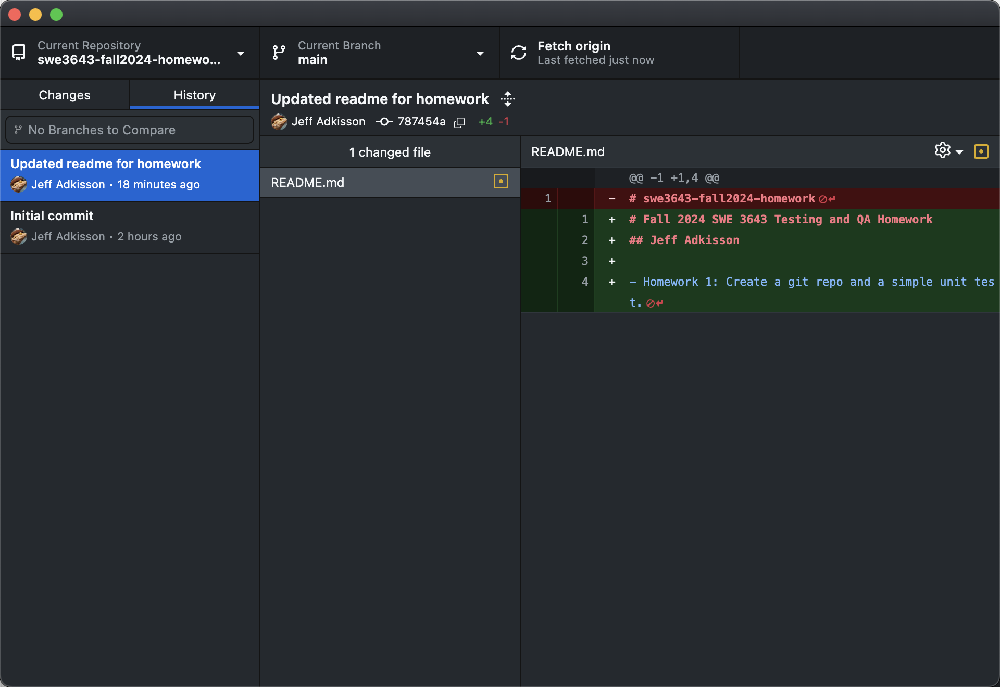

#### View Your Commit in GitHub

1. Open your GitHub account in a browser and find your **swe3643-fall2024-homework**

   repository. The URL will be something like `https://github.com/YOUR_GITHUB_USERNAME_HERE/swe3643-fall2024-homework`.
   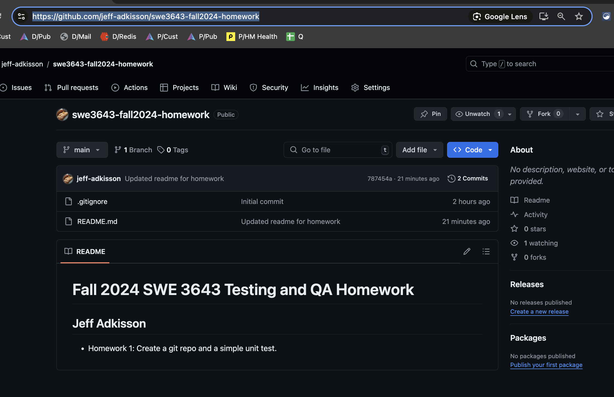

​	You will note that your change to the `README.md` file visible and nicely formatted.

3. You can see the commits to your repository by clicking the **# Commits** link (under the blue Code button):

   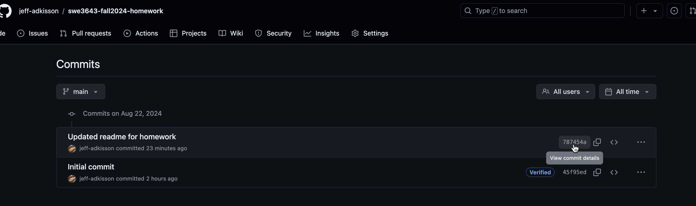

4. Click on the commit you made when you updated the `README.md` file. This will show you the changes you made to each file that was pushed to GitHub. The comment features are for collaborating on the code with other people who work on the repository with you.
   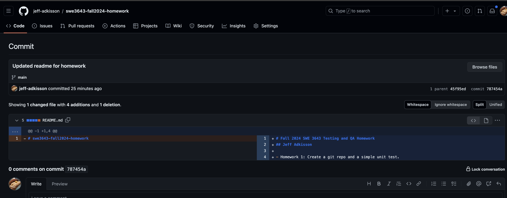

## Part 2: Write Your First Unit Test

#### Install a JetBrains IDE

This course uses JetBrains IDEs. I do not cover or support other IDEs. Your project submission will require the use of a JetBrains IDE for demonstrations of unit test execution and coverage.

1. Sign up for a JetBrains student license. This is free and gives you full access to all JetBrains products while you are a student. It is an *outstanding* value. With this license, you do not have to use the less capable community editions.
   https://www.jetbrains.com/community/education/#students
2. Installl the IDE you plan to use this semester. All JetBrains IDEs are cross-platform, so you can install them on Windows, Mac, or Linux.
   - Java: Intellij Ultimate Edition
   - C#: Rider
   - Python: Pycharm
3. Start the IDE and write a quick "Hello, World" application that writes "Hello, World" to the console. Once this is done, your IDE and environment should be operational.; You do not need to retain the "Hello, World" application.

#### Create Your Homework Project in your Homework Repository

In this part, you will follow a unit testing tutorial related to your language of choice, check in the work you did to your local `git` homework repository, then push the work to GitHub.

1. In the next step, you will follow a tutorial to do basic unit testing in a JetBrains IDE using your language of choice. Follow all instructions carefully. When you start the tutorial, be sure you are putting your work inside of the directory on your machine of your local `git` homework repository. If you do not do this, you will not be able to check in your work.

2. Open Explorer/Finder and locate your `git` homework repository. Create a folder named `homework-1` in the same directory as the `README.md`, then place all work in/under `homework-1`. For example:
   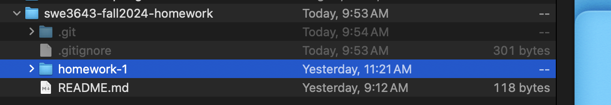

3. Follow one of the following tutorials based on your language of choice. When performing your tutorial, be sure your work is located in/under the `homework-1` directory you just created.

   1. **C# Tutorial**  
      *This tutorial assumes you know a bit more than the other tutorials. Therefore, I put a few extra instructions to help you get started. Pay close attention to my notes here.*

      Start by creating a console project and adding the Calculator class from the link below, then pick up the rest of the tutorial. You will also need to create a reference from the test project to the console project so the test project can access the Calculator class in the console project. A reference tells C# that project B can access code in project A. Without a reference, your test project will not be able to call the Calculator class in the console project.

      https://www.jetbrains.com/help/rider/Getting_Started_with_Unit_Testing.html#step-1-add-unit-test-project
      https://www.jetbrains.com/help/rider/Extending_Your_Solution.html#project_assembly_references
      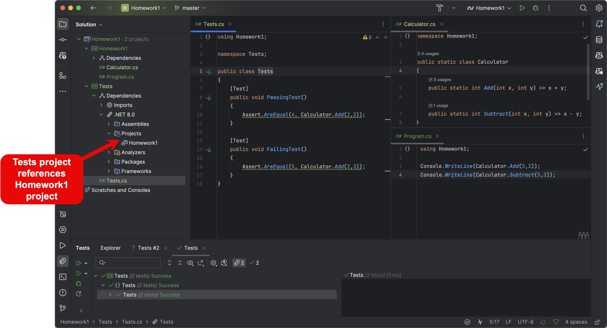

   - **Java Tutorial**

     Follow the tutorial below. *Follow the Maven instructions.*
     https://www.jetbrains.com/help/idea/junit.html

   - **Python Tutorial**
     *The Java and C# tutorials follow a calculator example. This tutorial is related to cars.*
     https://www.jetbrains.com/help/pycharm/pytest.html

4. After completing the tutorial, you need to check in your homework to your `git` repo, then push it to GitHub. Switch to GitHub desktop. You should see your work in your homework repository waiting to be checked in. If you do not, then you did not put your tutorial work in the right place (use Explorer/Finder to move it to the right spot).
   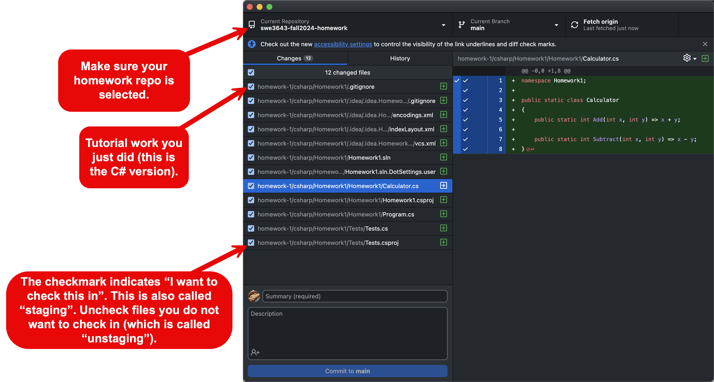

5. Make sure everything is staged to commit. Type a short summary of the check in in the box below the list of staged files. Write something like `Completed homework 1 tutorial`. Click **Commit to main** after writing the message.
6. Switch to the History tab. You will be able to see the commit you just performed and the files related to the commit.
   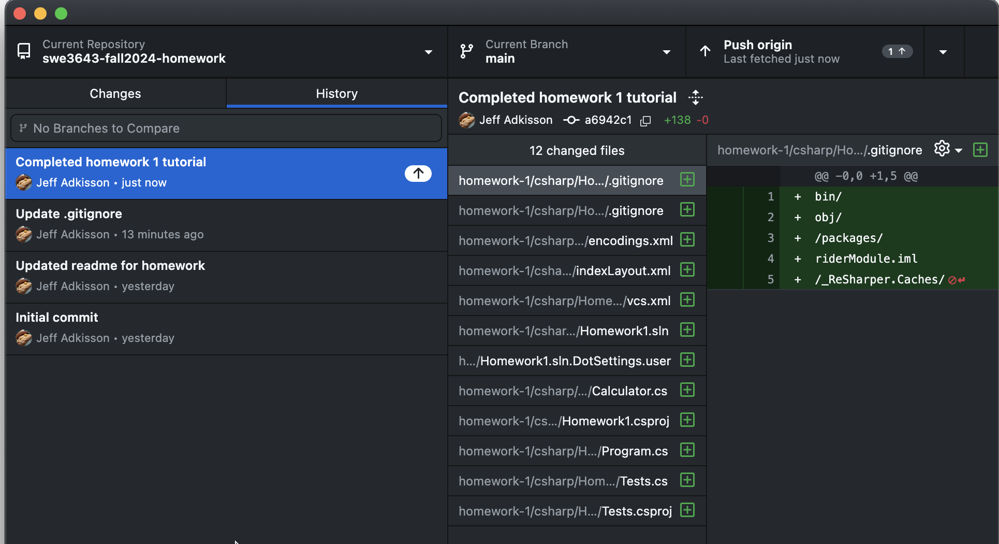
7. Your changes are in your local repository. You need to push the GitHub next. GitHub Desktop notes this on the Changes tab when everything is checked in:
   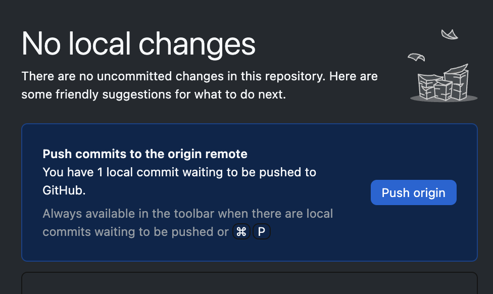
8. Click **Push origin** to send your latest work to GitHub.
   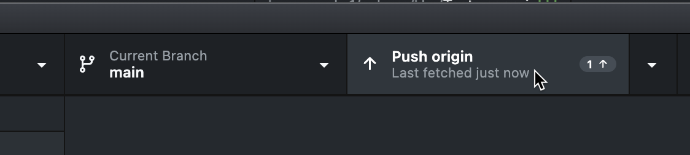

9. Open your GitHub homework repository in a browser. Note that you can do this from GitHub Desktop by right-clicking the **Current Repository** and selecting **View on GitHub**.
   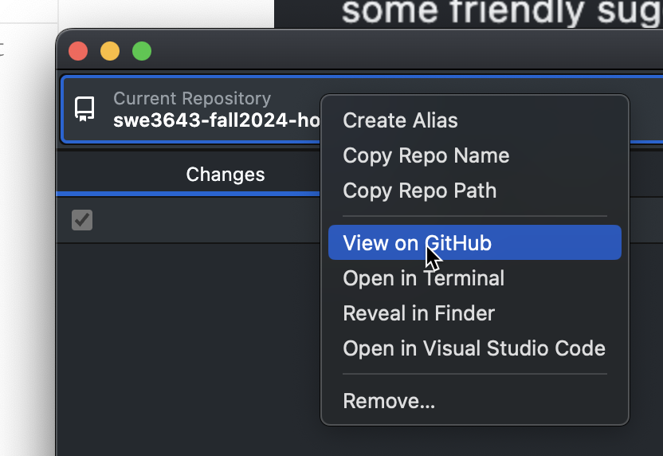

10. If everything is correct, you will see your latest commit and your `homework-1` directory in the remote GitHub repository:
    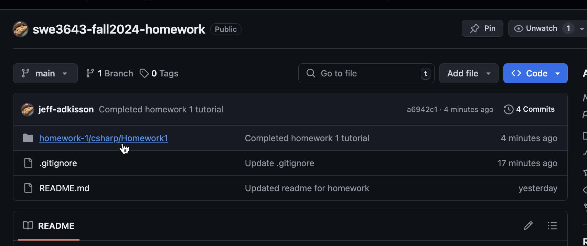

## Summary

1. You created a public homework repository on GitHub.
2. You made a local clone of your homework repository on your machine.
3. You updated your local homework repository's README.md markdown file.
4. You committed your README.md file changes to your local repository, then pushed your changes to GitHub.
5. You viewed your work on GitHub.
6. You used a JetBrains IDE to follow a simple tutorial to perform a unit test in your language of choice.
7. You added the tutorial work to your local homework repository in the `homework-1` directory.
8. You commited your `homework-1` files to your local repository.
9. You pushed your `homework-1` work to GitHub.
10. You confirmed your `homework-1` work is present in your GitHub repository.

## Extra Work You Might Consider

This is optional, but recommended.

#### Clone Your Repo Again using the `git` Command Line Tool

Sometimes we forget to commit everything. One simple way to verify everything you wanted to commit is present is to make a new clone of your GitHub repo, then see if everything still works. You can delete the new clone when finished. This is an excellent way to ensure the work you share on GitHub will compile and execute properly for the next person who clones your code (such as your instructor at the end of the semester). These steps will also demonstrate how to use the command line (Terminal) to clone your work. This is good practice so you learn how to use `git` without a GUI helper like GitHub Desktop. GUI tools are very helpful, but you also need to learn to confidently use the command line.

1. Visit your `homework` GitHub repository and copy the **HTTPS** URL of the repository. Click the **Code** button to open the dialog showing the link:
   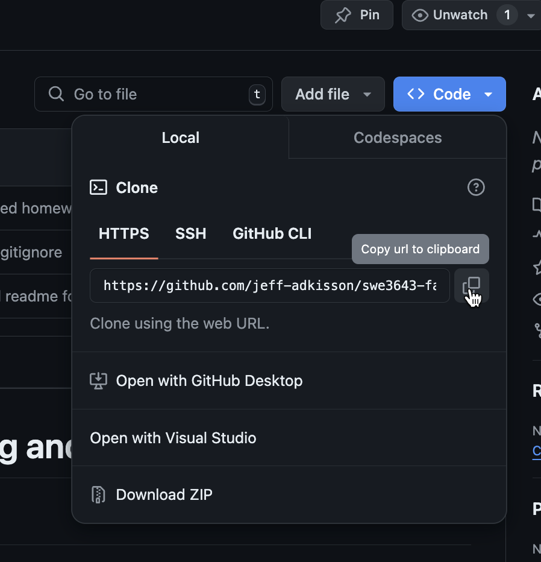
2. Open a Termina/Command Prompt on your machine after copying the URL.
3. Change to a directory *not* in your current homework repository. I suggest switching to the directory that contains your homework repository.
   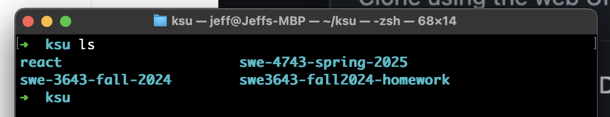
4. Create a new directory called `temp`, then switch to it.
   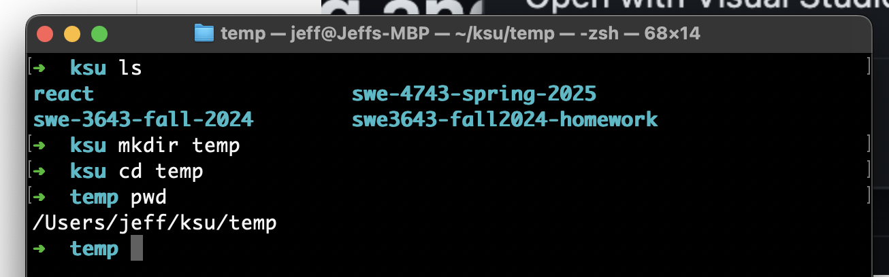

5. Clone the second copy of your repository using the command below:
   `git clone [URL]`
   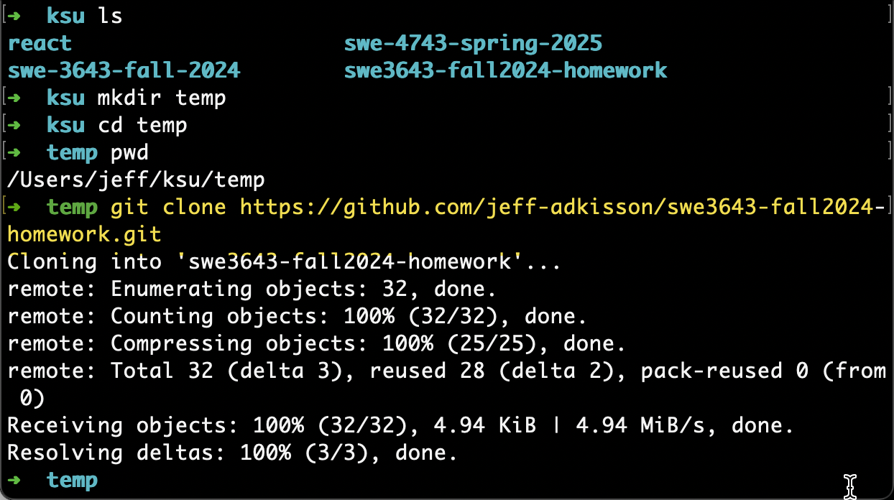

6. Open your JetBrains IDE and open the new temporary clone. Verify you can run the unit tests you wrote. If not, you may be missing some code. Verify everything is committed properly from the homework section, then delete the `temp` clone and try again. 
7. Assuming everything worked, you have now verified that someone else can clone your homework repository and run it. This is an essential skill you need to master before graduation to be competitve in the current market.

#### Execute Your Tests from the Command Line

Learning how to execute your projects from the Command Line (Terminal/Command Prompt) is an important skill many students do not learn in college. Students are too reliant on IDEs to run their projects. In the real world, software gets deployed and run without an IDE. Learning how to run your code from the command line is a step toward learning how to rely on an IDE less.

Running the tests your wrote in Homework 1 from the command line is easy in C# and Python. It is not as easy in Java, but it can be done and I encourage you to try it if that is your preferred language.

**C#**

1. Open a Terminal/Command prompt.
2. Navigate to your `homework-1` directory.
3. Navigate to the `Tests` directory. This directory will contain a `csproj` file and a class that holds your tests:
   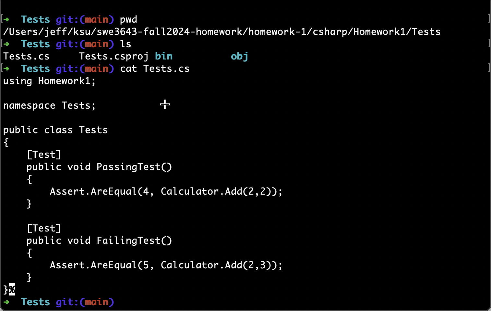
4. Type `dotnet test` to execute the tests in the Test project:
   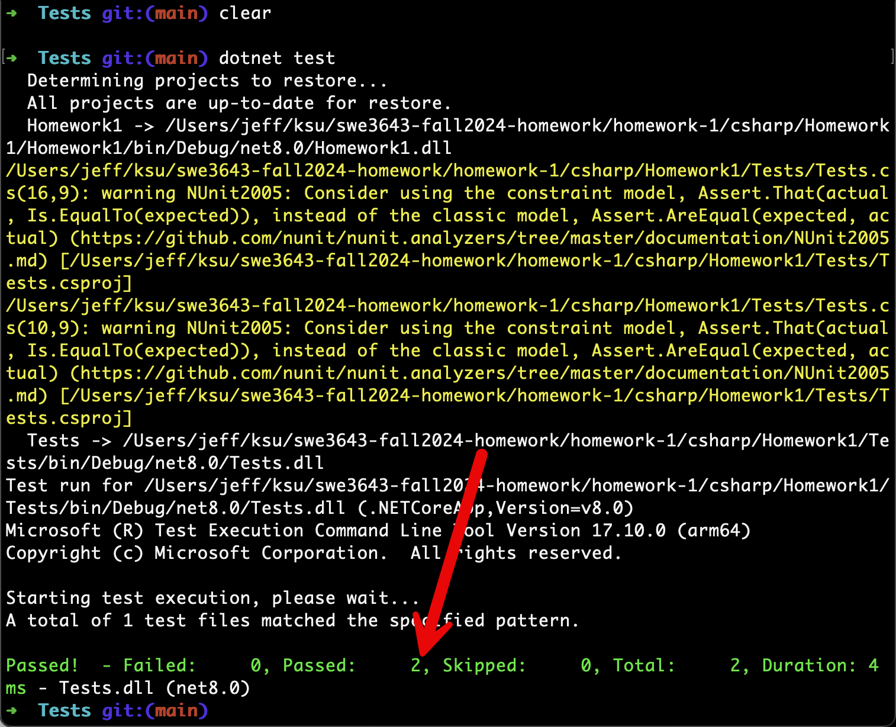
   *Note: The warnings are telling you there are some methods that might improve your code. Get used to reading warnings and fixing them (or suppressing, if not relevant). Warnings are your friend.*

**Java**

Running unit tests for a Maven project from the command line involves some configuration of your `pom.xml` file. Follow the steps in this tutorial to learn the method:

https://mkyong.com/maven/how-to-run-unit-test-with-maven/

**Python**

Running tests for a Python project from the command line is quite simple. You typically only need to execute `pytest`  from the directory containing your tests. Follow the steps in this tutorial to learn the method:

https://carpentries-incubator.github.io/python-testing/05-pytest/index.html

#### Got This Far? Do Another Language

You might have noticed that C#, Java, and Python all operate a bit different. Each language is very capable and has a massive following in the industry. It is to your benefit to be proficient in more than one language at graduation.

I recommend learning at least C# or Java *plus* Python (which is very different from C#/Java).

C# and Java are heavily used in enterprise applications. Python is essential for machine learning and data science. All three provide outstanding employment opportunities. Having some confidence in at least one object-oriented language (C#/Java) and one dynamic language (Python) is a great way to build your skill set as you enter the job market.

## Written Homework 1 from Prior Semesters

*This is the original homework 1 for this course. We will discuss this in class. This material is useful for preparing for the midterm. I encourage you to review it and give it a try.*

This assignment is aimed at assessing your understanding of the notion of quality and different measuring techniques that we can use to evaluate product quality in software testing. 

1. A company uses the following metric to gauge product quality. Once a bug is reported, that same bug is closed if it cannot be recreated by the testing team. Naturally, this lead to a high defect fix rate. Based on what you’ve learned in Chapter 17, concisely identify at least two problems with this approach. As the testing manager, how would you modify this plan to more accurately reflect product quality?
2. Dijkstra asserts that “Program testing can be used to show the presence of bugs, but never to show their absence!” Explain this statement. Provide one real world example that is not related to computing.
3. What is Software Quality? How do you know when the software provided is considered good software? And how do you know that an update is better than the previous version? 

4. You are assigned the task of creating a program that adds two two-digit integers. Can you test the program exhaustively? If so, how many test cases are required? Assuming that each test case can be executed and analyzed in one second, how long would it take for you to run all of the tests? Fully explain your answer, along with all assumptions. No credit will be given for answers that simply show a calculation.

5. In his article discussing Software Metrics, Kan discusses using Lines of Code (LOC) to assess product quality. Is this a good metric? Why or why not? Make sure your answer is not opinion. Support your answer with material from the article.