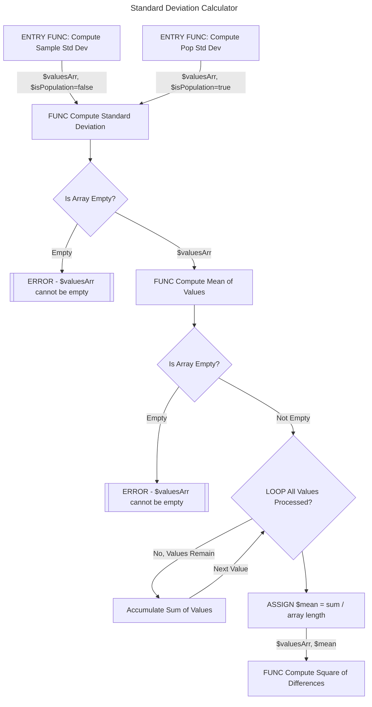
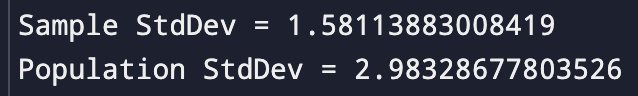

# Homework 2

The goals of this second exercise include:

- converting an algorithm with moderately high cyclomatic complexity into a graph to facilitate writing unit tests to test and cover each branch.
- writing unit tests in a language of your choice using various assertion techniques including parameterized testing and testing for errors, null conditions, and equality.
- exploring coverage techniques and considering the differences between method coverage, line coverage, and branch coverage. You will view coverage information in the JetBrains IDE of your language of choice.
- continuing to learn Markdown and `git` by checking your Homework2 and a README.md file into GitHub.

[Homework 1](homework-1.md) was mostly a step-by-step recipe with little original effort. This assignment will tax you a bit more, so please dedicate the time and effort to complete it. *Everything* you see here will appear in the semester project.

## Homework 1 is Prerequisite

Homework 2 assumes you completed and understood the material in Homework 1. 

[If you have not done Homework 1, go there and do it first](homework-1.md)

## I Need Help

Try Homework 2, then stop by my desk after any lecture for help. I almost always stay after to help students. You must attempt Homework 2 before requesting help. Remember that you have significant Internet resources to assist you. If you are having trouble with Homework 2, you can also expect me to review your completed [Homework 1](homework-1.md) effort, so do not skip that.

If you want me to review your work after you check it in, you are welcome to email the URL to your GitHub homework repository.

## Homework 2 Steps

1. **Perform Branch Analysis**<br/>
   Study a block of pseudocode and convert it to a graph showing every possible path
2. **Convert Pseudocode to Operational Code**<br/>
   Convert the pseudocode to the language of your choice
3. **Write Unit Tests**<br/>
   Write unit tests to achieve 100% coverage of every branch
4. **Perform Coverage Analysis**<br/>
   Execute coverage analysis in your JetBrains IDE
5. **Check-in Homework 2 to your GitHub Homework Repository**<br/>
   Practice submitting completed code with a README to your source control repository

#### Section 1: Perform Branch Analysis

1. Study the [Standard Deviation Calculator Pseudocode](#standard-deviation-calculator-pseudocode) below.

2. Draw a flowchart of *every* branch through the application. When complete, you should have a node for every condition in the application. 
   - Do not draw one node per line. You are graphing the branches through the application from start to finish. Branches are places where the flow of the code proceeds in a new direction. Your graph will reflect branches at conditions, function calls, and ternary expressions. Loops also exhibit branching behavior because the loop evaluates whether the continue looping at each iteration's start, end (or even in the middle).
   - You do not need to graph the MAIN node. When you study the code, you will likely see why. You will have a single entry node to your tree.

3. I recommend making your flowchart with [Mermaid.js](https://mermaid.js.org/syntax/flowchart.html) (though you might want to draw it by hand to start). This is good practice, and you can put it directly into a README markdown file for rendering in GitHub, Visual Studio Code, JetBrains IDEs, etc. See the [GradeLetterGenerator demo for an example.](https://github.com/jeff-adkisson/swe-3643-fall-2024/tree/main/examples/TestCoverage#graph-of-gradelettergenerator)

   [PlantUML is another good alternative for diagrams via simple code rather than manually clicking and drawing.](https://plantuml.com/activity-diagram-beta) 

   [Take a look at this article on why diagramming via Mermaid or PlantUML is often (not always) better for documentation than using a visual diagramming tool.](https://dev.to/gallau/mermaid-a-better-way-to-version-diagrams-4ba0)

#### Branch Analysis Hint

Here is a portion of the branch analysis graph to get you started.




#### Section 2: Convert Psuedocode to Operational Code

1. Create a new console project in the language of your choice called Homework2. Put it next to your Homework1 folder in the Homework repository you created in Homework 1. 
   
2. Convert the [Standard Deviation Calculator Pseudocode](#standard-deviation-calculator-pseudocode) into operational code. When you run the application, it will output the following to the console:<br/>
   

#### Section 3: Write Unit Tests

1. Configure your Homework 2 project to include unit tests using the same techniques for structuring the unit tests that you performed in Homework 1.
   - Unit tests are separate from your production code.
   - Unit tests are named *SystemUnderTest_StateBeingTested_ExpectedResults*.
     For example, *StandardDeviation_ReceiveNullValueList_ThrowException*.
   - Unit tests follow the [AAA pattern: Arrange, Act, Assert](https://medium.com/@pjbgf/title-testing-code-ocd-and-the-aaa-pattern-df453975ab80).
2. Write unit tests using your application with the proper naming convention and AAA pattern for every branch you diagrammed in the previous section. Your goal is 100% branch coverage (not just line coverage or method coverage).
   - In Homework 1, you use simple assertions to test for equality. In this exercise, you will use additional assertion types, such as length, null (empty), and whether a method returned an exception. Remember that Google is your friend and that you have enormous resources on the Internet, particularly StackOverflow, YouTube, and the documentation for your unit test library to help you.
     -  C#/Nunit (do not use XUnit or MSTest):
        https://docs.nunit.org/articles/nunit/writing-tests/assertions/classic-assertions/Assert.Throws.html
     -  Java/JUnit:
        https://www.baeldung.com/junit-assert-exception
     -  Python/Pytest:
        https://pytest-with-eric.com/introduction/pytest-assert-exception/

#### Section 4: Perform Coverage Analysis

1. Run your unit tests from the prior section in your JetBrains IDE with test coverage.

2. If your unit tests cover every branch condition from your diagram, you should be at 100% coverage.

   - If you are not at 100% coverage, use your IDE to study which lines are not covered. Did you miss a condition?

3. Convert the following pseudocode to a method in your language of choice. Do not add a unit test yet.
   ```
   #######
   # Naive function to summarize a standard deviation value
   Function INTERPRET_STANDARD_DEVIATION(stdDev):
   
   	  stdDev = Round(stdDev, 1)
   
       If stdDev > 2.0 Then
           Return "Above Average"
       Else If stdDev < -2.0 Then
           Return "Below Average"
       Else If stdDev == 0.0 Then
           Return "Exactly Average"
       Else
           Return "Near Average"
   
   ```

4. Re-run your coverage statistics. Your coverage will once again be below 100%.

5. Write a *parameterized* unit test that tests each branch of the INTERPRET_STANDARD_DEVIATION function.

   - C#/NUnit - TestCase
     https://docs.nunit.org/articles/nunit/writing-tests/attributes/testcase.html
   - Java/JUnit - ParameterizedTest and ValueSource
     https://coderpad.io/blog/development/writing-a-parameterized-test-in-junit-with-examples/
   - Python/Pytest - pytest.mark.parametrize
     https://docs.pytest.org/en/7.1.x/how-to/parametrize.html

   Following is a pseudocode example for a parameterized unit test:

   ```
   @TestParameter(2.5, "Above Average")
   @... additional values testing every branch ...
   Function STANDARD_DEVIATION__RECEIVE_STDDEV_VALUE__RETURN_LABEL(stdDev, expectedLabel):
     
       #act
       actualLabel = INTERPRET_STANDARD_DEVIATION(stdDev)
       
       #assert
       ASSERT_ARE_EQUAL(actualLabel, expectedLabel)
   ```

6. Re-run your coverage statistics. Your coverage should once again be 100%.

7. Take a screenshot of your 100% coverage results in your JetBrains IDE. In the next section, you will include the screenshot in the `README.md` file for Homework 2.

#### Section 5: Check-in Homework 2 to your GitHub Homework Repository

1. Create a file named `pseudocode.txt` in the Homework2 folder and copy the [Standard Deviation Calculator Pseudocode](#standard-deviation-calculator-pseudocode) into it.

2. Create a README.md file in the root directory of Homework2.

3. Put the following Markdown in your `Homework2/README.md` file. Include the screenshot of your coverage analysis from the prior section. You can embed your diagram directly into your Markdown if it is Mermaid.js. Otherwise, take a photograph of your diagram with your phone (or a screenshot, if you made it with an application such as Dia) and reference the file.

   ```markdown
   # Homework 2
   
   1. Performed Branch Analysis
      *Studied a block of pseudocode and converted it to a graph showing every possible path*
      { YOUR BRANCH DIAGRAM HERE }
   2. Converted Pseudocode to Operational Code
      *Converted the pseudocode to operational, well-structured { LANGUAGE YOU USED }*
      { LINK TO PSEUDOCODE FILE }
   3. Wrote Unit Tests
      *Wrote {# of Tests} { NUnit, JUnit, or PyTest } unit tests and achieved 100% coverage of every branch*
   4. Performed Coverage Analysis
      *Achieved 100% coverage of all branches*
      { SCREENSHOT OF YOUR COVERAGE ANALYSIS HERE }
   ```

4. Check-in your Homework2 folder to your local `git` homework repository.

5. Push your changes to your remote GitHub repository.

6. Visit the URL for your GitHub repository and navigate to the Homework2 folder. 

   - Does your README.md file look correct? Fix any formatting problems.
   - Can you see your diagram and coverage image? 
   - Does the link to your pseudocode file work properly?

   ***Always take a few moments to carefully review your checked-in work. You put a lot of effort into this. Make sure it is all there and looks great. Bad software engineers submit broken and incomplete code. It is very frustrating! Learn to do this properly, and your future teammates will enjoy working with you.***

## Standard Deviation Calculator Pseudocode

[What is pseudocode?](https://builtin.com/data-science/pseudocode)

```
#######
# Start Application
Function MAIN():

    sampleValuesList = [9, 6, 8, 5, 7]
    sampleStdDev = COMPUTE_SAMPLE_STANDARD_DEVIATION(sampleValuesList)
    Print("Sample StdDev =", sampleStdDev)
    # Writes "Sample StdDev=1.5811388300841898"
    # From https://www.cuemath.com/sample-standard-deviation-formula/

    populationValuesList = [9, 2, 5, 4, 12, 7, 8, 11, 9, 3, 7, 4, 12, 5, 4, 10, 9, 6, 9, 4]
    popStdDev = COMPUTE_POPULATION_STANDARD_DEVIATION(populationValuesList)
    Print("Population StdDev =", popStdDev)
    # Writes "Population StdDev=2.9832867780352594"
    # From https://www.thoughtco.com/population-standard-deviation-calculation-609522


#######
# Function to compute the mean (average) of a list of values
Function COMPUTE_MEAN(valuesList:

    If valuesList is empty:
        Raise Error "valuesList parameter cannot be null or empty"
    
    sumAccumulator = 0
    For each value in valuesList:
        sumAccumulator = sumAccumulator + value
    
    # Return the average (sum divided by the number of values we accumulated)
    Return sumAccumulator / (Number of values in valuesList)
      

#######
# Function to compute the sum of squared differences from the mean
Function COMPUTE_SQUARE_OF_DIFFERENCES(valuesList, mean):
    
    If valuesList is empty:
        Raise Error "valuesList parameter cannot be null or empty"
    
    squareAccumulator = 0
    For each value in valuesList:
        difference = value - mean
        squareOfDifference = difference * difference
        squareAccumulator = squareAccumulator + squareOfDifference
    
    Return squareAccumulator
    

#######
# Function to compute the variance based on squared differences
#   Set isPopulation to true to compute a population standard deviation in COMPUTE_VARIANCE
#   Set isPopulation to false to compute a sample standard deviation in COMPUTE_VARIANCE
Function COMPUTE_VARIANCE(squareOfDifferences, numValues, isPopulation):

    # Adjust number of values by minus one if sample where sample is indicated by (not isPopulation)
    # https://www.quora.com/On-the-sample-standard-deviation-why-do-we-subtract-N-by-1
    
    If not isPopulation:
        numValues = numValues - 1
    
    # Test numValues after adjusting for change to numValues 
    #    We cannot allow numValues to be a 0 denominator (division by zero / undefined)
    If numValues < 1:
        Raise Error "numValues is too low (sample size must be >= 2, population size must be >= 1)"
    
    Return squareOfDifferences / numValues
      

#######
# Function to compute the population or sample standard deviation from a list of values
Function COMPUTE_STANDARD_DEVIATION(valuesList, isPopulation):
    
    If valuesList is empty:
        Raise Error "valuesList parameter cannot be null or empty"
    
    mean = COMPUTE_MEAN(valuesList)
    squareOfDifferences = COMPUTE_SQUARE_OF_DIFFERENCES(valuesList, mean)
    variance = COMPUTE_VARIANCE(squareOfDifferences, (Number of values in valuesList), isPopulation)
    
    Return SquareRoot(variance)
    # where SquareRoot is a math function to compute the square root of the variance


#######
# Function to compute the sample standard deviation from a list of values
Function COMPUTE_SAMPLE_STANDARD_DEVIATION(valuesList):

		# (false) in the following statement indicates we are computing a sample variance
    Return COMPUTE_STANDARD_DEVIATION(valuesList, false)


#######
# Function to compute the population standard deviation from a list of values
Function COMPUTE_POPULATION_STANDARD_DEVIATION(valuesList):

		# (true) in the following statement indicates we are computing a population variance
    Return COMPUTE_STANDARD_DEVIATION(valuesList, true)
```

