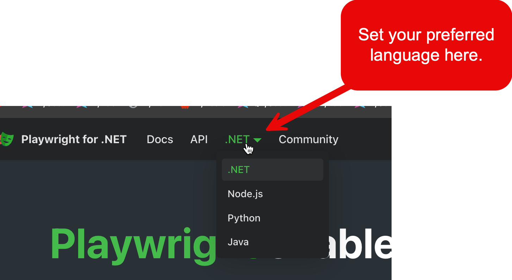

# Homework 3

Your semester project includes a web server application that performs statistical calculations. In addition to writing unit tests to cover 100% of the statistical library, you will write end-to-end tests that validate the operation of your web user interface using a popular web app testing tool called Playwright. To prepare for your project, you need to get to know Playwright.

The goals of this third exercise include:

- getting to know Playwright, and
  
- configuring and using Playwright, and
  - [Playwright for C#](https://playwright.dev/dotnet/docs/intro)
  - [Playwright for Java](https://playwright.dev/java/docs/intro)
  - [Playwright for Python](https://playwright.dev/python/docs/intro)

- completing the example tests for your chosen language provided by Playwright, and
- writing your own tests using the Playwright Test Generator, and
- continuing to learn Markdown and `git` by checking your Homework3 and a README.md file into GitHub.

[Homework 1](homework-1.md) was mostly a step-by-step recipe with little original effort. [Homework 2](homework-2.md) was involved branch analysis, standard and parameterized unit testing, and achieving 100% code coverage. Homework 3 will introduce you to end-to-end testing using Playwright, a popular framework for testing web-based applications. End-to-end testing (also called E2E) is a form of opaque box testing where you validate the operation of the surface controls of a system rather than the system's internal code and state. 

Homework 3 is much like Homework 1. You will follow a series of steps provided by Playwright to configure and run user interface tests.

Please dedicate the time and effort to complete this homework. *Everything* you see here will appear in the semester project.

## Homework 1 and 2 are Prerequisite

Homework 3 assumes you completed and understood the material in Homework 1 and Homework 2 

If you have not completed [Homework 1](homework-1.md) and/or [Homework 2](homework-2.md), please complete those before starting Homework 3.

## I Need Help

Try Homework 1 and 2, then stop by my desk after any lecture for help. I almost always stay after to help students. You must attempt Homeworks 1 and 2 before requesting help. Remember that you have significant Internet resources to assist you. If you are having trouble with Homework 3, you can also expect me to review your completed [Homework 1](homework-1.md)  and [Homework 2](homework-2.md) efforts, so do not skip those.

If you want me to review your work after you check it in, you are welcome to email the URL to your GitHub homework repository.

## What does Playwright do?

Playwright is a specialized tool for user interface testing. Your user interface is typically the outermost surface of your application exposed to end users. Playwright tests connect to your web-UI and validate that it operates in the manner you specify in your Playwright tests.

Since you are testing the UI and the UI uses the lower layers of your application (controllers, models, business logic, services, data layers), it implicitly tests many (but not necessarily all) of the lower layers of your application.

Playwright does not generate coverage information.


## How Does Playwright Work?

Playwright is a complex architecture, but is easy to use. The Client Library (C#, Java, etc.) provides the API you will use to connect with web sites to test. All of the rest of the architecture is invisible to you.


To fully understand Playwright testing, you need to know the basics of how a browser works. Browsers are clients that connect with servers to make HTTP requests. HTTP requests transfer HTML and other data such as CSS, JavaScript, and images from a server to a client.


## Homework 3 Steps

1. **Get to Know Playwright**
   Watch a video and browse the documentation.
2. **Configure Playwright for your Chosen Language**<br/>Install Playwright for your operating system and chosen language
3. **Complete the Example Playwright E2E Tests**<br/>Complete an example unit test from the documentation to validate that Playwright is operational
4. **Use the Playwright Test Generator to Write an E2E Test**<br/>Write an E2E test using Playwright's test recording tool
5. **Execute Tests from the Command Line/Terminal**<br/>Execute your Playwright tests from the Command Line/Terminal
6. **Check-in Homework 3 to your GitHub Homework Repository**<br/>
   Practice submitting completed code with a README to your source control repository

## Section 1: Get to Know Playwright

1. [Watch this YouTube video giving an overview of Playwright. It will give you a good idea what Playwright does. The video is only 15 minutes.](https://www.youtube.com/watch?v=mB7YxSmnJz8)
2. Browse the Playwright documentation at https://playwright.dev/. Be sure to properly set your preferred language so the site automatically shows you material relevant to the language your project uses.
   

### Section 1: **Configure Playwright for your Chosen Language**

1. Go to the Getting Started page for your chosen language. You can also change the language in the top navigation bar.
   - [Playwright for C#](https://playwright.dev/dotnet/docs/intro) for NUnit (*not* MSTest)
   - [Playwright for Java](https://playwright.dev/java/docs/intro) for JUnit
   - [Playwright for Python](https://playwright.dev/python/docs/intro) for Pytest

2. Create a new directory in your homework repository called homework-3. Put it next to your homework-1 and homework-2 folder. 
   

3. *Carefully* follow every step in the Playwright Getting Started | Installation page for your chosen language. Place the projects, files, etc. the Installation page lists in your homework-2 directory. 
   *Almost 100% of problems with Playwright start right here. To make Playwright operate properly, you must carefully follow every line of the Installation process. If it is not working, do the installation process over, carefully focusing on every step, line, note, and comment.*

   Typical problems per language/OS include I have seen include:

   - **C#** - You *must* have PowerShell installed. Use NUnit, *not* MSTest.
   - **C# on Mac** - You *must* have PowerShell. I did not even know they had this for Mac before starting work with Playwright (I thought it was only a Windows language).
   - **Java** - You must use [Maven](https://maven.apache.org/guides/getting-started/maven-in-five-minutes.html) as your build system. If you use Gradle, you are on your own. [Get to know Maven here.](https://maven.apache.org/guides/getting-started/maven-in-five-minutes.html)
   - **Python** - You must have Python 3.8 installed and a recent verson of `pip`. 

### Section 3: Complete the Example Playwright E2E Tests

Playwright's documentation includes two examples for each language that run E2E tests using their website as the target.

- **C#**
  - https://playwright.dev/dotnet/docs/intro#add-example-tests
  - https://playwright.dev/dotnet/docs/writing-tests#first-test
- **Java**
  - https://playwright.dev/java/docs/intro#first-script
  - https://playwright.dev/java/docs/writing-tests#introduction
- **Python**
  - https://playwright.dev/python/docs/intro#add-example-test
  - https://playwright.dev/python/docs/writing-tests#first-test

### Section 4: Use the Playwright Test Generator to Write an E2E Test

Playwright has a friendly test generator that will help you write sophisticated tests simply by clicking and navigating in your web-UI while the test generator watches the actions you took.


### Section 5: Execute Tests from the Command Line/Terminal

Learning how to run code from your machine's command line/terminal (commonly called the CLI - Command Line Interface) is an important skill. Students rely too much on IDEs such as Intellij and Visual Studio to execute code. The future user of the applications you write professionally will not use an IDE to run your application, so get out of the habit now of only running your code in an IDE.

Another reason for mastering the ability to run your projects from the CLI is because many employers looking at your GitHub repository when evaluating your work will follow this process:

1. Future Employer asks you for your GitHub repo so they can review some of your public work.
2. You send a link to the repo to Future Employer along with some recommendations of the best examples of your work.
3. Future Employer clones the repo, navigates to something interesting, briefly peruses the `README.md` that has easy-to-follow instructions how to execute your project from the CLI, then executes the project from the CLI.
4. If your `README.md` says "To run this application, install Eclipse or run it in [IDE here]", Future Employer is likely to move on to the next candidate, *particularly* if they have to install that tool to run your project. Remember - not everyone uses the same tools as you, even if they are working in the same language.  Command line proficiency makes you more competitive in the job market.

You have enormous competition for jobs. You must take advantage of everything you can to get your work the attention it deserves. Therefore, learn to use the CLI.

- **C#** - https://playwright.dev/dotnet/docs/running-tests#run-all-tests
- **Java** - https://playwright.dev/java/docs/intro#running-the-example-script
- **Python** - https://playwright.dev/python/docs/running-tests#command-line

### Section 6: Check-in Homework 3 to your GitHub Homework Repository

1. Create a README.md file in the root directory of Homework 3.

2. Put the following Markdown in your `Homework3/README.md` file. 

   ```markdown
   # Homework 3
   
   1. Configured Playwright
   2. Verified Operation with a Sample Playwright Test
      { SCREENSHOT OF YOUR Sample Playwright TEST HERE }
      { SCREENSHOT OF YOUR JETBRAINS TEST RUNNER SHOWING SUCCESS OF Sample Playwright TEST }
   3. Wrote an E2E Test using the Playwright Test Generator
      { SCREENSHOT OF YOUR Generated Playwright Test HERE}
      { SCREENSHOT OF YOUR JETBRAINS TEST RUNNER SHOWING SUCCESS OF Generated Playwright TEST }
   4. Executed Tests from Command Line / Terminal
      { SCREENSHOT OF TERMINAL SHOWING COMMANDS TO START TESTING, PLUS RESULTS}
   ```

3. Check-in your Homework3 folder to your local `git` homework repository.

4. Push your changes to your remote GitHub repository.

5. Visit the URL for your GitHub repository and navigate to the Homework2 folder. 

   - Does your README.md file look correct? Fix any formatting problems and check-in the corrections.
   - Can you see your images? 

   ***Always take a few moments to carefully review your checked-in work. You put a lot of effort into this. Make sure it is all there and looks great. Bad software engineers submit broken and incomplete code. It is very frustrating! Learn to do this properly, and your future teammates will enjoy working with you.***

