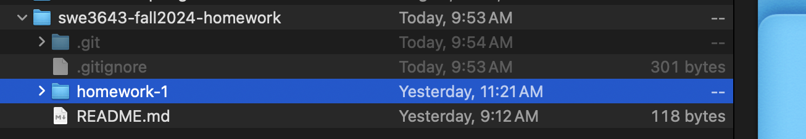

# Homework 3

*This document is a work in progress...*

The goals of this third exercise include:

- configuring and using a popular opaque box web app testing tool called Playwright.
  - [Playwright for C#](https://playwright.dev/dotnet/docs/intro)
  - [Playwright for Java](https://playwright.dev/java/docs/intro)
  - [Playwright for Python](https://playwright.dev/python/docs/intro)

- complete the example tests for your chosen language provided by Playwright.
- writing your own E2E Playwright test using the Playwright Test Generator.
- continuing to learn Markdown and `git` by checking your Homework2 and a README.md file into GitHub.

[Homework 1](homework-1.md) was mostly a step-by-step recipe with little original effort. [Homework 2](homework-2.md) was involved branch analysis, standard and parameterized unit testing, and achieving 100% code coverage. This final homework assignment will introduce you to end-to-end testing using Playwright, a popular framework for testing web-based applications. End-to-end testing (also called E2E) is a form of opaque box testing where you validate the operation of the surface controls of a system rather than the system's internal code and state. 

Please dedicate the time and effort to complete this homework. *Everything* you see here will appear in the semester project.

## Homework 1 and 2 are Prerequisite

Homework 3 assumes you completed and understood the material in Homework 1 and Homework 2 

If you have not completed [Homework 1](homework-1.md) and/or [Homework 2](homework-2.md), please complete those before starting Homework 3.

## I Need Help

Try Homework 1 and 2, then stop by my desk after any lecture for help. I almost always stay after to help students. You must attempt Homeworks 1 and 2 before requesting help. Remember that you have significant Internet resources to assist you. If you are having trouble with Homework 3, you can also expect me to review your completed [Homework 1](homework-1.md)  and [Homework 2](homework-2.md) efforts, so do not skip those.

If you want me to review your work after you check it in, you are welcome to email the URL to your GitHub homework repository.

## Homework 3 Steps

1. **Configure Playwright for your Chosen Language**<br/>Install Playwright for your operating system and chosen language
2. **Complete the Example Playwright E2E Tests**<br/>Complete an example unit test from the documentation to validate Playwright is operational
3. **Use the Playwright Test Generator to Write an E2E Test**<br/>Write an E2E test using Playwright's test recording tool
4. **Execute Tests from the Command Line/Terminal**<br/>Execute your Playwright tests from the Command Line/Terminal
5. **Check-in Homework 3 to your GitHub Homework Repository**<br/>
   Practice submitting completed code with a README to your source control repository

### Section 1: **Configure Playwright for your Chosen Language**

1. [Before you install anything, watch this YouTube video giving an overview of Playwright. It will give you a good idea what Playwright does. The video is only 15 minutes.](https://www.youtube.com/watch?v=mB7YxSmnJz8)
2. Go to the Getting Started page for your chosen language. You can also change the language in the top navigation bar.
   - [Playwright for C#](https://playwright.dev/dotnet/docs/intro) for NUnit (*not* MSTest)
   - [Playwright for Java](https://playwright.dev/java/docs/intro) for JUnit
   - [Playwright for Python](https://playwright.dev/python/docs/intro) for Pytest
3. Create a new directory in your homework repository called homework-3. Put it next to your homework-1 and homework-2 folder. 
   

4. *Carefully* follow every step in the Playwright Getting Started | Installation page for your chosen language. Place the projects, files, etc. the Installation page lists in your homework-2 directory. 
   *Almost 100% of problems with Playwright start right here. You must carefully follow every line of the Installation process to make Playwright operate properly.*

   Typical problems per language/OS include:

   - C# - You *must* have PowerShell installed (even on a Mac [yuck - I dislike PowerShell]). Use NUnit, *not* MSTest.
   - Java - You must use [Maven](https://maven.apache.org/guides/getting-started/maven-in-five-minutes.html) as your build system. If you use Gradle, you are on your own. [Get to know Maven here.](https://maven.apache.org/guides/getting-started/maven-in-five-minutes.html)
   - Python - You must have Python 3.8 installed and a recent verson of `pip`. 

5. 

### Section 2: Complete the Example Playwright E2E Tests

1. 

### Section 3: Use the Playwright Test Generator to Write an E2E Test

1. 

### Section 4: Execute Tests from the Command Line/Terminal

1. 

### Section 5: Check-in Homework 3 to your GitHub Homework Repository

1. Create a README.md file in the root directory of Homework 3.

2. Put the following Markdown in your `Homework3/README.md` file. 

   ```markdown
   # Homework 3
   
   1. Configured Playwright
   2. Verified Operation with a Sample E2E Test
      { SCREENSHOT OF YOUR Sample E2E TEST HERE }
      { SCREENSHOT OF YOUR JETBRAINS TEST RUNNER SHOWING SUCCESS OF Sample E2E TEST }
   3. Wrote an E2E Test using the Playwright Test Generator
      { SCREENSHOT OF YOUR Generated E2E Test HERE}
      { SCREENSHOT OF YOUR JETBRAINS TEST RUNNER SHOWING SUCCESS OF Generated E2E TEST }
   4. Executed Tests from Command Line / Terminal
      { SCREENSHOT OF TERMINAL SHOWING COMMANDS TO START TESTING, PLUS RESULTS}
   ```

3. Check-in your Homework3 folder to your local `git` homework repository.

4. Push your changes to your remote GitHub repository.

5. Visit the URL for your GitHub repository and navigate to the Homework2 folder. 

   - Does your README.md file look correct? Fix any formatting problems and check-in the corrections.
   - Can you see your images? 

   ***Always take a few moments to carefully review your checked-in work. You put a lot of effort into this. Make sure it is all there and looks great. Bad software engineers submit broken and incomplete code. It is very frustrating! Learn to do this properly, and your future teammates will enjoy working with you.***

