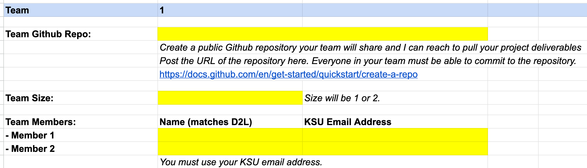
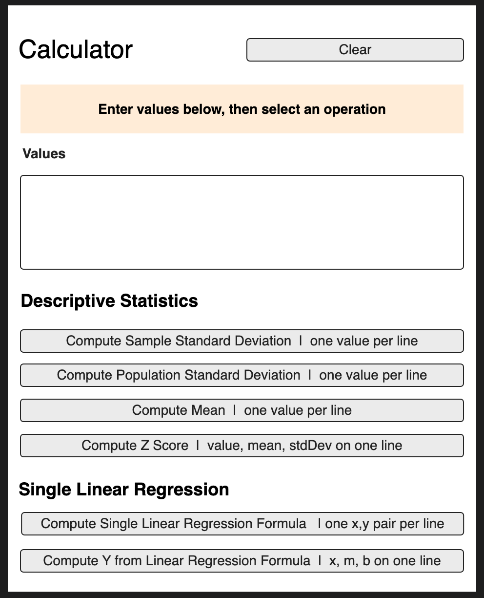
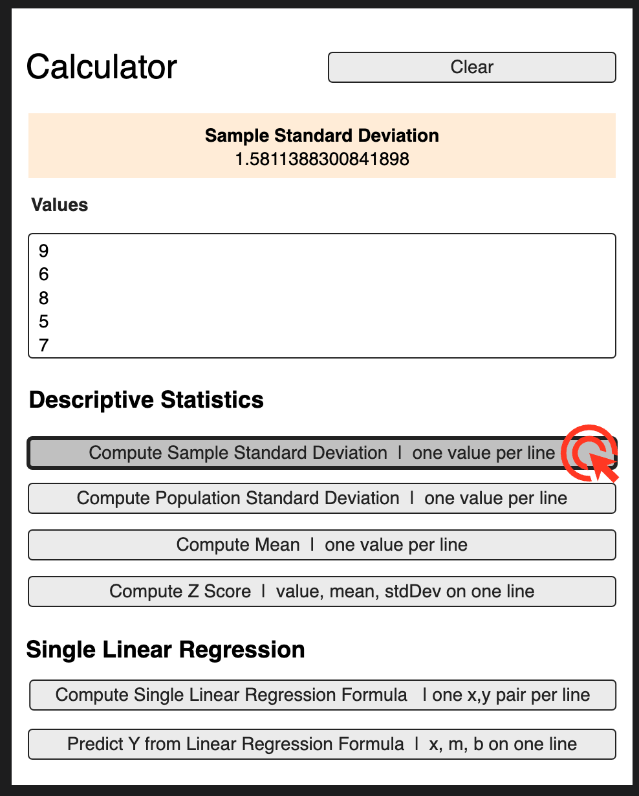
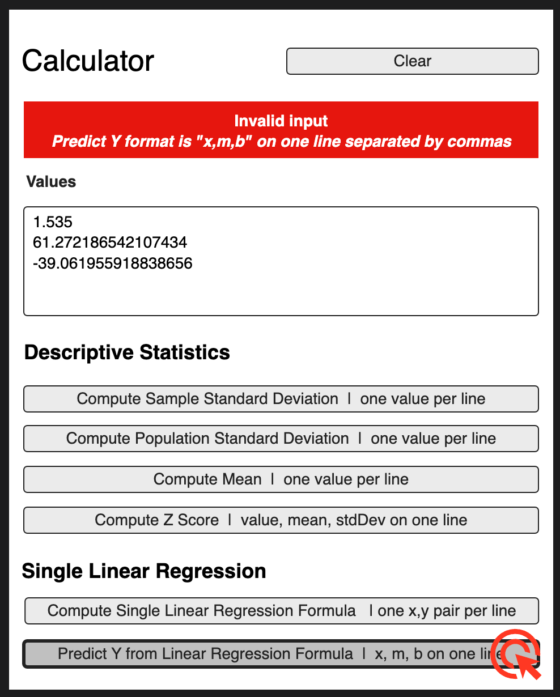
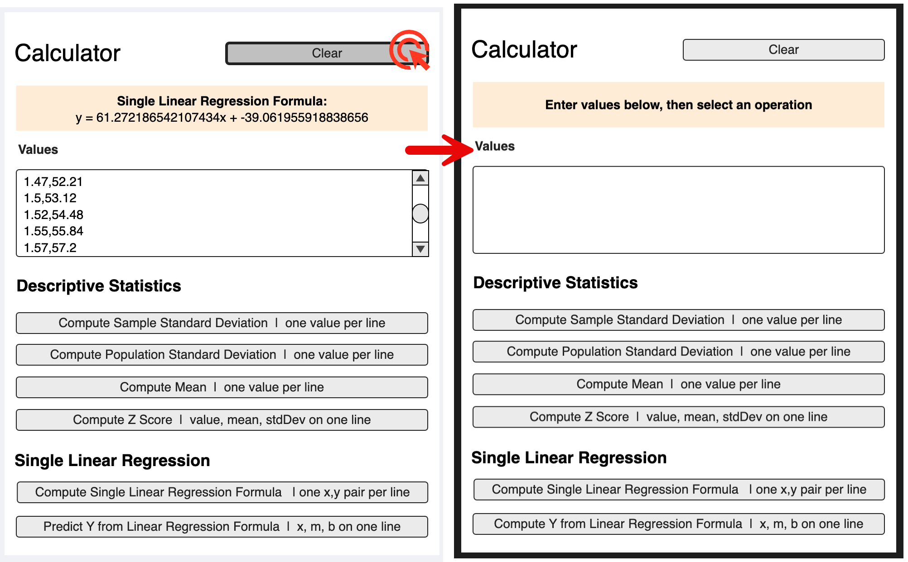
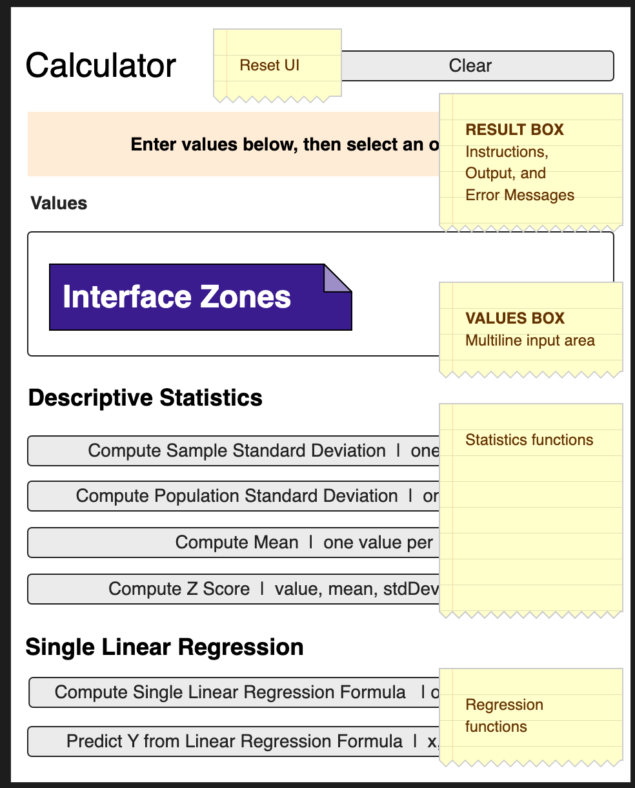
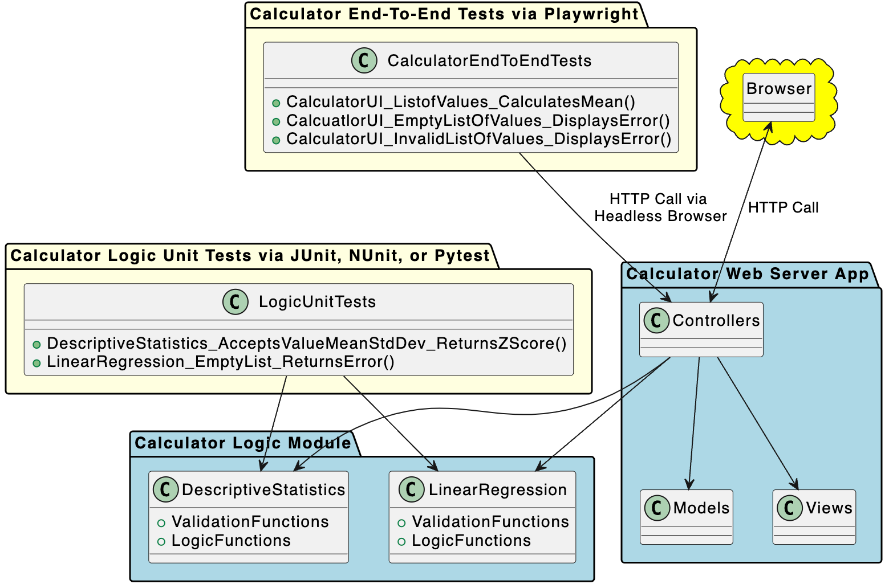

#### KSU SWE 3643:<br/>Software Testing and Quality Assurance<br/>Semester Project

# Table of Contents

-  [Project Overview](#project-overview)
-  [Grading Rubric](grading-rubric.md)
-  Requirements (Wed Oct 9)

# Project Overview

You will execute a semester project to help reinforce many of the testing concepts covered this semester. You will also gain valuable coding practice and source control experience.

The project includes:

- Creating a web-based calculator that performs some basic statistical functions, including:

   -  computing a mean (average) from a list of numeric values.
   -  computing sample and population standard deviations from a list of numeric values.
   -  computing a z-score from a value, mean, and standard deviation.
   -  computing a single variable regression formula in the form of y =mx + b where you derive m (slope) and b (intercept) from a list of x,y numeric pairs (separated by a comma, one pair per line).
   -  predicting a y value from a regression formula where you supply the x value, the slope (m) and the intercept (b).

   You will build your web-based calculator in Java, C#, or Python. You will create your calculator logic and unit test it independently from the UI/web interface. To facilitate unit testing, the web-based UI will *reference* your calculator logic rather than tightly couple the logic with your UI code, and

-  Adding unit tests to the calculator logic classes (the classes that perform the calculations) to achieve 100% coverage of the calculation methods. You will write your unit tests using the [industry-standard AAA pattern (arrange, act, assert)](https://medium.com/@pjbgf/title-testing-code-ocd-and-the-aaa-pattern-df453975ab80) and [follow the `UnitOfWork_StateUnderTest_ExpectedBehavior` naming convention](https://osherove.com/blog/2005/4/3/naming-standards-for-unit-tests.html), and

-  Performing automated end-to-end testing on your web-based UI using [Playwright](https://playwright.dev/) scripts, and

-  Writing documentation in [Markdown](https://www.markdownguide.org/) describing the runtime environment, how to execute your project from the command line, and how to run your tests from the command line, and

-  Producing a 5-to-8-minute video demonstrating your completed application, a demonstration of running your unit tests and Playwright scripts from the command line, and showing that you reached 100% coverage of your calculator logic using your IDE. Note that this video is an essential part of your submission, so take this requirement very seriously, and

-  Checking all of your source code, tests, and documentation into GitHub. You will not submit your project via D2L, zip file, or email. Your entire project must be available to Jeff in your public GitHub project repository.

## Your Team

You will execute the project alone as a **Team of 1** or with a single partner as a **Team of 2**. There are no teams greater than 2 people.

-  **Team of 1: Work Alone**<br/>You will execute the entire project alone. This is a good option if you are confident in your abilities, prefer to work independently, prefer high control over your projects, or have difficulty scheduling with another person. **If you work alone, you are responsible for all the work.** This was always my preferred choice as a student because it left me in 100% control of my success. This approach also gives you the greatest amount of experience.
-  **Team of 2: Work with a Partner**<br/>You and a teammate will execute the entire project and share the same grade. This is a good option if you can find someone who complements your abilities or shares a schedule similar to yours. **Remember - you will share the same grade, so choose wisely.** Sometimes, teammates disappoint you, and you must shoulder the burden to ensure your success is not impacted. There is a possibility that your teammate will drop the course. *You must be ready to deliver if your teammate does not.* Disputes with your teammate must be resolved by you and your teammate. Once again, **choose wisely**.

[You will enter your team information into the spreadsheet at this link](https://docs.google.com/spreadsheets/d/1jFQaJhe6cDqOvw_Oi5D_qNoN9UaW43gmb4pK6shfZpo/edit?usp=sharing) by October 14, 2024 at 11:59 PM EST. This is your first project grade. Your team information is worth 5% of the total project. I will verify your submission on October 15th and enter your team's grade in D2L.

**Your team cannot change after October 14, 2024.**

Your team information spreadsheet includes your team's GitHub repo, team size (1 or 2), and team contact information.

[](https://docs.google.com/spreadsheets/d/1jFQaJhe6cDqOvw_Oi5D_qNoN9UaW43gmb4pK6shfZpo/edit?usp=sharing)

## Your Web Application

### Browser Interface

Your web application will perform calculations on lists of numbers. The default state of the browser interface will look like the following when started (and following clicking the **Clear button**):



When valid input is present in the Values box and you click one of the calculation buttons, your web application will compute the result on the server and display the result in the highlighted result box as follows:



If you enter invalid data, such as an empty Values list or improperly formatted line of data, the application will show a red result box labeled **Invalid Input** followed by a line explaining the expected format of the operation you attempted.



Clicking the **Clear** button will reset the result box and the Values box to their default state.



[Please review the prototype user interface at this link.](https://app.moqups.com/MvLts3wDDVQ8TNQBIdQN5nOCilbNhjYo/view?ui=0) You can move through the interface examples by clicking anywhere on the pages.



### Architecture

Your application will separate calculation logic from web logic. This will simplify unit testing, help your code achieve the single responsibility principle, and decouple the logic engine from the user interface.



You will note:

-  The **Calculator Logic** accepts values from the web server, performs the calculation logic, and returns results.
-  The **Calculator Web Server App** references the **Calculator Logic** module. The **Calculator Web Server App** generally follows the [MVC pattern](https://en.wikipedia.org/wiki/Model%E2%80%93view%E2%80%93controller) to generate the user interface (Views), calls the Calculator Logic module (via the Controller), and returns results to the user's browser (by combining a Model into a View for transformation into HTML). Native application technologies such as WinForms, JavaFX, Vaadin, QT, etc. are not permitted.
-  The **Calculator Logic Unit Tests** only reference the **Calculator Logic**. The unit tests *do not* test this project's Calculator Web Server App.
-  The **Calculator End-to-End Tests** connect to your **Calculator Web Server App** via Playwright and test the user interface end-to-end (which includes calling the Calculator Logic from the web server's controller).

You must carefully structure your code to achieve this architecture. In particular, you cannot closely couple the calculator logic with the calculator UI. For example, if you perform a calculation in the Calculator Web Server App's controllers, models, or views, *you are doing it wrong*. The controller class in the Calculator Web Server App requests calculations from the Calculator Logic classes and renders the results.

With a logical separation of the Calculator Logic from the Calculator Web Server App, you can write effective, high-coverage unit tests of your calculation logic. Remember - unit tests are clear box testing mechanisms with high visibility into the detailed operation of your classes and methods. To write effective unit tests, you cannot mix web server routing and rendering logic with your domain logic.

### Calculator Operations

The calculator user interface and logic will enable the following operations:

| Button                                                       | Inputs                                                       | Returns                                                      | Example                                                      |
| ------------------------------------------------------------ | ------------------------------------------------------------ | ------------------------------------------------------------ | ------------------------------------------------------------ |
| **Compute Sample Standard Deviation  \| one value per line** | List of **one** or more numeric values, one value per line<br /><br />Ignore empty lines and spaces<br /><br /><br />Error when:<br />- any line contains a non-numeric value (such as "123X" or "123,124")<br />- there is not a single valid numeric value | Sample standard deviation of values in list                  | 9<br/><br/>6<br/><br/>8<br/><br/>5<br/><br/>7<br /><br />Returns<br />1.5811388300841898 |
| **Compute Population Standard Deviation  \| one value per line** | List of **two or more** numeric values, one value per line<br /><br />Ignore empty lines and spaces<br /><br /><br />Error when:<br />- any line contains a non-numeric value (such as "123X" or "123,124")<br />- there are fewer than two valid numeric values | Population standard deviation of values in list              | 9<br/><br/>6<br/><br/>8<br/><br/>5<br/><br/>7<br /><br />Returns<br />1.4142135623731 |
| **Compute Mean  \| one value per line**                      | List of **one or more** numeric values, one value per line<br /><br />Ignore empty lines and spaces<br /><br /><br />Error when:<br />- any line contains a non-numeric value (such as "123X" or "123,124")<br />- there is not a single valid numeric value | Mean (average) of values in list                             | 9<br/><br/>6<br/><br/>8<br/><br/>5<br/><br/>7<br /><br />Returns<br />35 |
| **Compute Z Score  \| value, mean, stdDev on one line**      | **Three and only three numeric values** separated by commas on a single line<br /><br />Error when:<br /><br />- the first line does not contain three and only three numeric values separated by commas (ignore spaces)<br /><br />- there is more than one line of values<br />- the standard deviation value is zero (division by zero) | Z-score for a value (1st value) using the mean (2nd value) and standard deviation (3rd value) | 11.5,7,1.5811388300841898<br <br /><br />Returns<br />2.846049894151541 |
| **Compute Single Linear Regression Formula  \| one x,y pair per line** | List of **one or more** X,Y comma-separated number pairs (one X,Y pair per line).<br /><br />Ignore empty lines and spaces<br /><br />Error when:<br />- any line does not contain exactly two valid numeric values separated by a comma (ignore spaces)<br />- there is not a single X,Y pair | Regression formula in the form y = mx + b                    | 1.47,52.21<br/><br/>1.5,53.12<br/><br/>1.52,54.48<br/><br/>1.55,55.84<br/><br/>1.57,57.2<br/><br/>1.6,58.57<br/><br/>1.63,59.93<br/><br/>1.65,61.29<br/><br/>1.68,63.11<br/><br/>1.7,64.47<br/><br/>1.73,66.28<br/><br/>1.75,68.1<br/><br/>1.78,69.92<br/><br/>1.8,72.19<br/><br/>1.83,74.46,<br /><br />Returns<br />y = 61.272186542107434x + -39.061955918838656 |
| **Predict Y from Linear Regression Formula  \| x, m, b on one line** | **Three and only three** numeric values separated by commas on a single line<br /><br />Error when:<br /><br />- the first line does not contain three and only three numeric values separated by commas (ignore spaces)<br /><br />- there is more than one line of values | Prediction for y value when x (first value) is multiplied by m (slope, second value) and added to the intercept (b, third value) | 1.535,61.272186542107434, -39.061955918838656<br /><br />Returns<br />y = 54.990850423296244 |
| **Clear**                                                    |                                                              | Resets the Value box and Results box to the application start state |                                                              |

### Languages, Web Server Architectures, and Test Runners

Your choice of languages, server architectures, and test runners includes:

-  C# / .NET Core 8 or newer (do not choose .NET Framework)
   -  ASP.NET Blazor Server + NUnit + Playwright 
      *Use Interactive Server Mode, not WASM or static SSR*
   -  ASP.NET MVC + NUnit + Playwright
-  Java / Version 17 or newer
   -  Spring Boot  + JUnit + Playwright
      *Use Maven 3.5+, Spring Initializer, and the instructions at https://spring.io/guides/gs/spring-boot*
-  Python / Version 3.14 or newer
   -  Flask + Pytest + Playwright

## Questions You Might Be Asking Yourself

### Why Are We Doing Math?

These functions are well-documented, easy to implement, and highly testable. The math is not complex for anyone in this field, especially considering the math prerequisites for students in the College of Computing.

If you are concerned about the math, do a simple console project to master each technique before starting to code your project solution. Watch a YouTube video or visit Kahn Academy.

- [Sample and Population Standard Deviation](https://www.khanacademy.org/math/statistics-probability/summarizing-quantitative-data/variance-standard-deviation-sample/a/population-and-sample-standard-deviation-review)
- [Single Variable Linear Regression](https://www.khanacademy.org/math/statistics-probability/describing-relationships-quantitative-data/introduction-to-trend-lines/a/linear-regression-review)

### I Am Freaking Out! I Have Not Done Web Development! What Should I Pick?

Every framework listed has huge communities of developers who have posted outstanding online tutorials on sites like YouTube. You will find resources easily. It would be best if you made the time to try the tutorials and learn the basics of what you choose. This is exactly how professional engineers operate when assigned a new project. I often purchase a cheap course from Udemy when learning a new technology. They have excellent materials, and the cost is usually less than $20.

For best results, stick with the language you know best unless your teammate (if you have one) is even more confident in another language. Do not pick what looks cool or what you think will look best on your resume. Pick what will give you the best chance of performing well on the project. I have seen students start with something ambitious and fail when they should have picked something more reasonable and succeeded. The goal of our profession is working software... customers do not care how cool the framework is and how beautiful your code is if it meets their requirements. *Remember this.*

**If you are not confident in any of the options above, pick C# and Blazor Server.** I am most proficient with C# and have recent professional experience with Blazor Server. That means I can provide the most help and advice with that choice.

### Are You Going to Teach Me Every Tiny Thing I Need to Know?

*No, but I will show you the way to success.*

Your First Year instruction (FYE) gave you the programming basics you need to execute this project. You also have some experience with projects and working in teams from Software Engineering 1. Finally, you have been learning problem-solving approaches your entire academic career.

You must watch YouTube videos, read blog posts, visit the manufacturer's sites, and do independent research. This is how the real world works. Your future employer will not take you by the hand with every new project.

*No one can teach you how to program but yourself.* The only way to be a good programmer is to do the work. Sometimes, that will mean long, frustrating nights at your computer working out problems and endlessly researching obscure compiler errors. Everyone in this field has had those days and nights.

**You can do this. Be confident in yourself and budget your time wisely. I am here to help you, but you must do the work. Be sure to engage this project before the last minute.**

### Am I All Alone Here? I Feel Very Nervous...

You must learn some things independently, but you are not alone.

I am going to help you when you get stuck.

We are dedicating the last four lecture periods of the class to project work. I will be in the classroom to help students who need advice, additional resources, etc.

Every semester, I see nervous students achieve great things when given a bit of a push and a lot of support. **You can do this.**

### This is a Testing Class. Why Are We Writing a Web Application?

1.  You require practice building applications, learning new frameworks in short timeframes, and building the confidence to tackle projects like this.
2.  You require source control experience.
3.  You need experience presenting your work.
4.  You need experience separating UI concerns from logic concerns. Most of your student work to date tightly coupled logic and user interface code. Separating UI from logic is essential to effectively perform clear box unit testing and opaque box end-to-end testing.
5.  You require experience writing unit tests for the logic you create. You will see that certain approaches work better than others to automate your testing effectively.
6.  You need to experience writing end-to-end tests. That is easiest to do with web frameworks. Scripting end-to-end testing for UI frameworks such as JavaFX, Winforms, or TKinter can be arcane and is often platform-specific.
7.  One of the most pervasive problems in our field is that the development process is often separate from the test process. The [Test Driven Development (TDD)](https://testdriven.io/test-driven-development/) process will help you write better code that is durable and easier to maintain/refactor over time. Your unit tests will help document how your application works simply by showing how the components and methods work, what work together, and what they return. Therefore, you need to write unit tests *as you develop* an application.

### I Know React/Angular/Vue/otherSPAFrameworkHere. Can I Use That?

**No.** You must use a server framework that renders HTML on the server. SPA development is prohibited due to its higher complexity and risk of overall project failure. This project is complex enough—do not make it more complex. Your framework, language choices, and test runner must be in the list.

## Source Control via Git and GitHub

Your project will be hosted on a [public GitHub repository](https://docs.github.com/en/repositories/creating-and-managing-repositories/quickstart-for-repositories). Each team will have a separate public GitHub repository created by the team member(s). All team members must be able to checkin work to the project repository. Jeff (your instructor) must be able to access your project repository. Jeff will *not* check in or modify your repository, so you do not need to grant him any special access.

If you have never used source control, [watch some videos on `git`](https://www.youtube.com/results?search_query=git+for+beginners) and create a free GitHub account. If you are uncomfortable working with command line tools, install [GitHub Desktop](https://desktop.github.com/) or [GitKraken](https://www.gitkraken.com/) (my preference) to give you a friendly interface.

`Git` is *essential* for all software engineers regardless of industry and skill level. Do not graduate without source control expertise, including branching, merging, and pull requests. KSU usually does not teach these more advanced topics, so you should make this a personal goal. Use this project to start learning `git` and carry your knowledge forward after the course ends.

[The best developers *always use source control even when working alone*.](https://dev.to/nash4253/why-source-control-is-important-for-developers--5d8j) It is an essential skill you must develop.

## Documentation Written in Markdown

All documentation will be written in [Markdown](https://www.markdownguide.org/) and checked into your team's GitHub repository.

Project documentation will include a README.md file in the root directory of your project's GitHub repository that includes:

-  A short description of what is in the repository including an architectural diagram.
-  Instructions on building and executing the application from the command line, including all environment dependencies.
-  Instructions on executing the unit tests and Playwright tests from the command line.
-  A screenshot of your passing unit tests using a Jetbrains IDE.
-  A screenshot of your unit tests at 100% coverage using a Jetbrains IDE.
-  A link to your Final Video Presentation.

Writing Markdown is easy. I highly recommend writing Markdown using an IDE with a Markdown plugin (all JetBrains IDEs support this), Visual Studio Code with a Markdown extension, or a dedicated Markdown editor such as Typora.

> [!NOTE]
>
> *I am a big fan of [Typora](https://becomeawritertoday.com/typora-review/).* It is cross-platform, visually clean, and has strong spell-checking (a curiously unique feature in the Markdown world). I recommend giving it a try. I use it for all my work. It is a licensed tool, but its cost is very low ($15!). 
>
> No matter what you use, find a tool you like and master it. Other good options include Visual Studio Code extensions and Obsidian.

Markdown is not tool-specific, so whether you use Typora, an IDE, VS Code, or even write it by hand, the output will (generally) operate identically.

*Great engineers are great communicators.* We must reliably communicate very complex ideas to many people. Learn to write effectively and get the best writing tools you can afford. Be opinionated and passionate about the tools you use... they say a lot about you (I always ask what tools people love in interviews).

## Final Video Presentation

Your completed project will include a 5-to-8-minute video presentation.

Your video will demonstrate:

-  starting your application from the command line and using it from a web browser, and

-  executing your unit tests and playwright tests from a terminal/command line, and

-  showing 100% code coverage from your IDE.

Your presentation can be hosted on a public link at YouTube or Vimeo, or you can check the video file in your team's GitHub repository. The link to your presentation will be in your README file whether the video is checked in or hosted at YouTube or Vimeo.

Avoid producing a terrible, dull, hard-to-understand video. I must watch dozens of these, so have pity on me. It is also to your benefit to learn how to promote your work and give a polished presentation.

Put some effort into this to make it organized, concise, and engaging. Consider writing a script and using a PowerPoint presentation to frame each section of your video. Every semester, someone does a video that blows me away. This is an excellent skill to develop; it helps you showcase your work and promote yourself.

## The KSU Writing Center

The [KSU Writing Center](https://writingcenter.kennesaw.edu/) is an outstanding resource to improve your README and presentation. This free resource will help you learn to be a better writer and communicator. Towards the end of the semester, after you have pounded out your project documentation, I *highly* recommend going to the KSU Writing Center and have them help you polish your work. 

The best documentation is thorough, concise, well-organized, and targeted at a specific audience. Take avantage of this free resource for the expertise you might gain. I have said it already, but it bears repeating here: *great engineers are great communicators*. Learn to be a great communicator.

Areas where you might consider using the KSU Writing Center include:

-  Organizing and editing your README.md file. Write it first, then ask for help reviewing the material, using proper grammar, avoiding [passive voice](https://www.grammarly.com/blog/passive-voice/) in favor of active voice, writing meaningful titles, etc. This file targets a technical audience. [Review some resources how to write a good README file](https://www.freecodecamp.org/news/how-to-write-a-good-readme-file/) before getting started.
-  Helping you write a script for your Final Video Presentation. Most students do not do this. Frequently, these videos are just rambling recordings hitting the requirements. These could be more engaging and showcase your hard work. The best videos use slides to introduce each section, are carefully planned and recorded, and are a bit [shorter (shorter is good, assuming you cover the required material)](https://www.npr.org/sections/13.7/2014/02/03/270680304/this-could-have-been-shorter). Remember to [read some suggestions on how to present your work effectively](https://animoto.com/blog/video-ideas/video-presentation-ideas).

If the Writing Center does not do it for you, do not give up on becoming a better communicator. Two writing resources I have found both engaging and somewhat inspiring are:

-  [**On Writing** by Stephen King](https://www.fcusd.org/cms/lib/CA01001934/Centricity/Domain/3762/Stephen%20King%20On%20Writing.pdf)<br/>*This is such an entertaining book. **I am serious.** You will never look at adverbs the same way again.*

-  [**Elements of Style** by W. Struck, Jr. & E.B. White](https://faculty.washington.edu/heagerty/Courses/b572/public/StrunkWhite.pdf)

   *This book is packed with wisdom. Some of the grammar ideas presented are less relevant today than when it was produced, but overall, it is a gem. Following is a favorite quote from the text that I think applies to almost everything we do in our professional lives:*

   ```html
   It is an old observation that the best writers sometimes
   disregard the rules of rhetoric. When they do so,
   however, the reader will usually find in the sentence
   some compensating merit, attained at the cost of the
   violation. Unless he is certain of doing as well, he
   will probably do best to follow the rules. After he has
   learned, by their guidance, to write plain English 
   adequate for everyday uses, let him look, for the 
   secrets of style, to the study of the masters of 
   literature.
   ```

## Project Schedule

-  **Project Work Days**<br>
   No lecture, Jeff in classroom to assist teams. Attendance is optional.*
   
   -  Nov 4, Nov 6, Nov 11, Nov 13, Nov 18, Nov 20, Dec 2
   
-  **Project Submission - Monday Dec 2 by 11:59 PM**<br>

   I will clone all projects on Tuesday Dec 3 at midnight. 
   
   Late submissions receive the penalties outlined in the Syllabus.

### Suggested Schedule

Here are suggestions to help you structure your time.

1. Plan to complete your logic library and achieve 100% unit test coverage of the logic library by Nov 4. 
2. Have your web application operational (if not 100% complete) by Nov 18.
3. Have your end-to-end tests complete before the holiday break.
4. Over the break or on the last day of class, polish your code, documentation, and presentation. Finally, verify your submission before the due date.

The Thanksgiving break (week of Nov 25) can break your momentum. You also will be going into finals for other courses when you return. I suggest finishing most or all of your project before the break. Your project is due on the last day of class before midnight. That is also the first day back from the break.

## Submission Components

Your finished project will include:

-  A URL to your public team GitHub repository.
-  Working source code for your Calculator web application checked into your public team GitHub repository. Your source code will include *all assets necessary* to compile and execute your project. Every semester, someone submits a project missing large blocks of essential code or full of compiler errors. Do not be that person. Working code is what software engineers produce.

   IMPORTANT: Code that will not compile will automatically reduce your project score by 25% or more (depending on severity).
-  Working unit tests achieve 100% coverage of all Calculator Engine logic (some methods require multiple tests to test all requirements, such as division to check the division function and detect division by zero). All unit tests will be written using the [AAA pattern](https://medium.com/@pjbgf/title-testing-code-ocd-and-the-aaa-pattern-df453975ab80) and follow the [`UnitOfWork_StateUnderTest_ExpectedBehavior` naming convention](https://osherove.com/blog/2005/4/3/naming-standards-for-unit-tests.html).
-  Working end-to-end Playwright tests for various Calculator user interface functions, including several single and double operand functions, the Clear button, "not a number" conditions, and invalid input. All end-to-end tests will be written using the [AAA pattern](https://medium.com/@pjbgf/title-testing-code-ocd-and-the-aaa-pattern-df453975ab80) and follow the [`UnitOfWork_StateUnderTest_ExpectedBehavior` naming convention](https://osherove.com/blog/2005/4/3/naming-standards-for-unit-tests.html).
-  A detailed README.md written in Markdown explains the environment configuration and steps to execute your Calculator web application and tests from the command line. This file will also include a link to your final video presentation.
-  A video presentation checked into your team GitHub repository or hosted on YouTube/Vimeo that demonstrates your completed application, unit tests, and 100% coverage in your IDE.

## Grading

I will grade your project between the submission date and the day final grades are due. This will be a significant effort, so please submit on time if you can avoid it (plus your grade will also suffer).

This project is **50%** of your semester grade.

**Your final course grade can only be one letter grade higher than your project.** If you do poorly on the project, you will do poorly overall.

If your project meets the requirements in this document, not only will you receive a top score, but you will have earned valuable expertise and enhanced your GitHub repository with a great-looking project.

[View the grading rubric for more details.](grading-rubric.md) 

## Collaboration

You can collaborate with your teammate, but not with other teams. Each team's work must be their own.

If you choose to work alone, you commit to that decision for the project's duration. You cannot change your mind later.

When you are stuck, you are welcome to ask for advice from classmates or visit the KSU computer lab to get you moving again, *but* *your work must be your own.*

## AI Coding Assistance and Other Shortcuts

If you use an AI to do your project:

- I probably will not know.
- You will not learn much or anything. Using an AI (or copying a prior student's project or paying a homework assistance site, like Chegg, to do your project) is like going to the gym and watching other people work out—it is a waste of your time and money.
- You might get a good grade, but you probably will not be successful in the industry. [The same AI technologies that can help you complete this project is the same AI technology that is shrinking the market for entry level engineers.](https://www.cio.com/article/3509174/ai-coding-assistants-wave-goodbye-to-junior-developers.html) You must be able to do the work yourself to secure a position and keep it.

AI technolgy is powerful and has significant value. However, it can and will stunt your ability to learn problem solving and great coding skills. Please do your own work and reap the benefits of owning your new skills. It does not hurt me if you take a shortcut here... it only hurts you.

## When You Need Help

**I will try to assist you, but I will not write your code.**

-  Come to some or all of the project workdays at the end of the semester for help. Last-minute frantic emails just before the project is due are unlikely to get a helpful response.
-  You must do your best to solve your problem (or at least understand it) before asking for help.
-  I am most proficient with C#, so consider picking that language if you anticipate needing much help.

When you ask me for coding assistance:

-  **Be very specific.** If you are vague, I cannot help you. ”It’s not working.” is not specific.
-  **Always include your team’s public GitHub repository URL.**
-  Check the offending code in your GitHub repository so I can look at it and run it. If your code is not in your GitHub repository, I will not attempt to compile or run it. [Also consider creating a separate source branch](https://git-scm.com/book/en/v2/Git-Branching-Branches-in-a-Nutshell) before sharing problematic code with me to avoid breaking operational code in your main code trunk.
-  To compile and run your code, your **README.md** must have the environment configuration instructions and execution steps. Keep those accurate and up-to-date.

## Errors and/or Inconsistencies in these Documents

I have made this document as complete, consistent, accurate, and as approachable as time permitted.

If there is an error, or you suspect there is an error, let me know, and I will correct the problem. I am *not* trying to trick you or confuse you. Large technical documents are difficult to keep perfectly correct and internally consistent,

Thank you for your help in this matter.

## I Hope You Enjoy This Project

This is the kind of work you will do in professional practice. Many of the projects you do at the University are trivial efforts with minimal architectural requirements. This project will give you a glimpse of what it is like to work on something with detailed requirements and carefully considered architectural instructions.

It also achieves the primary goal of this course - to apply quality assurance principles and automated testing techniques.

