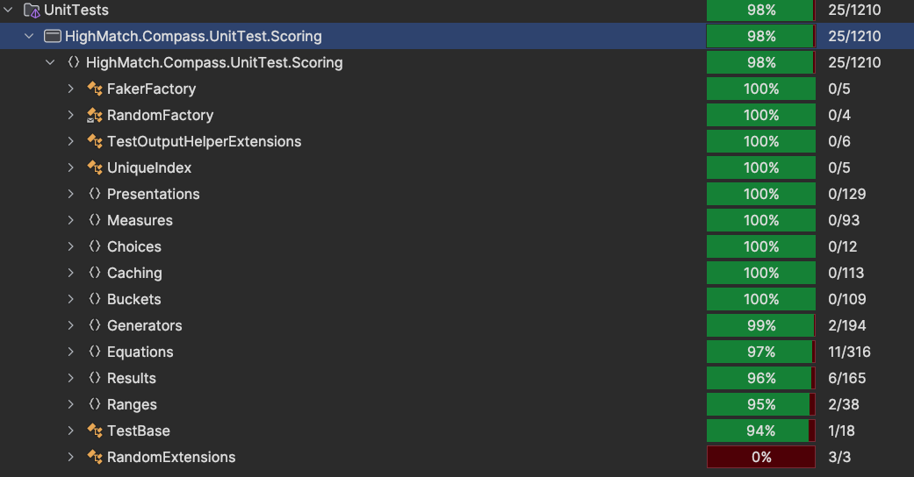
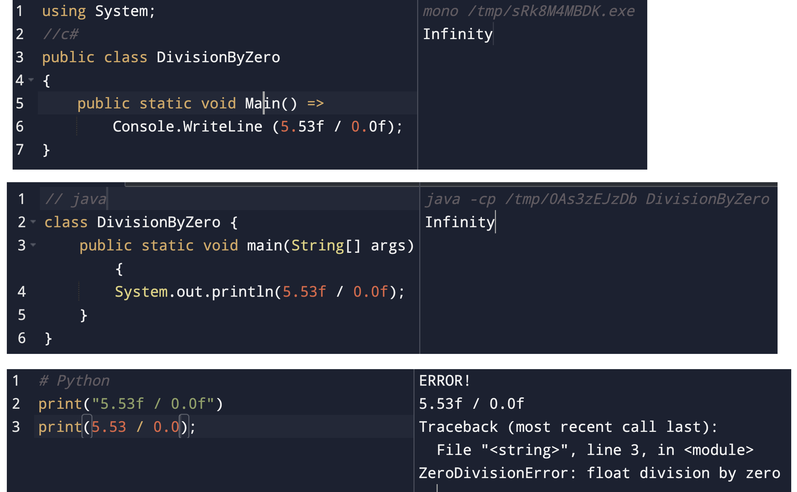
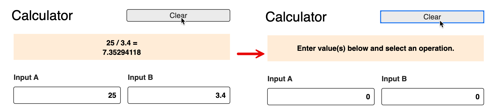
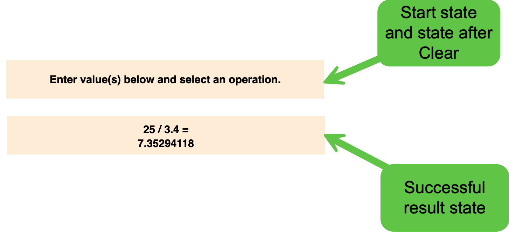
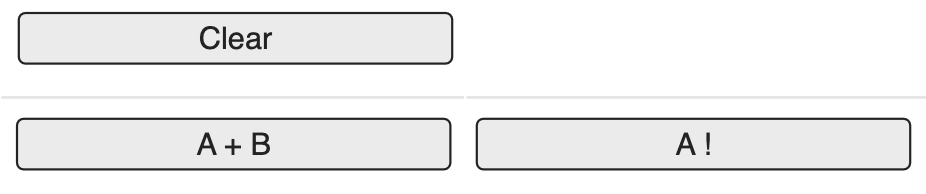
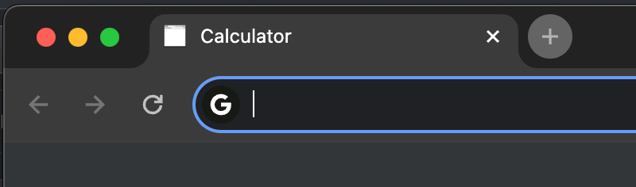
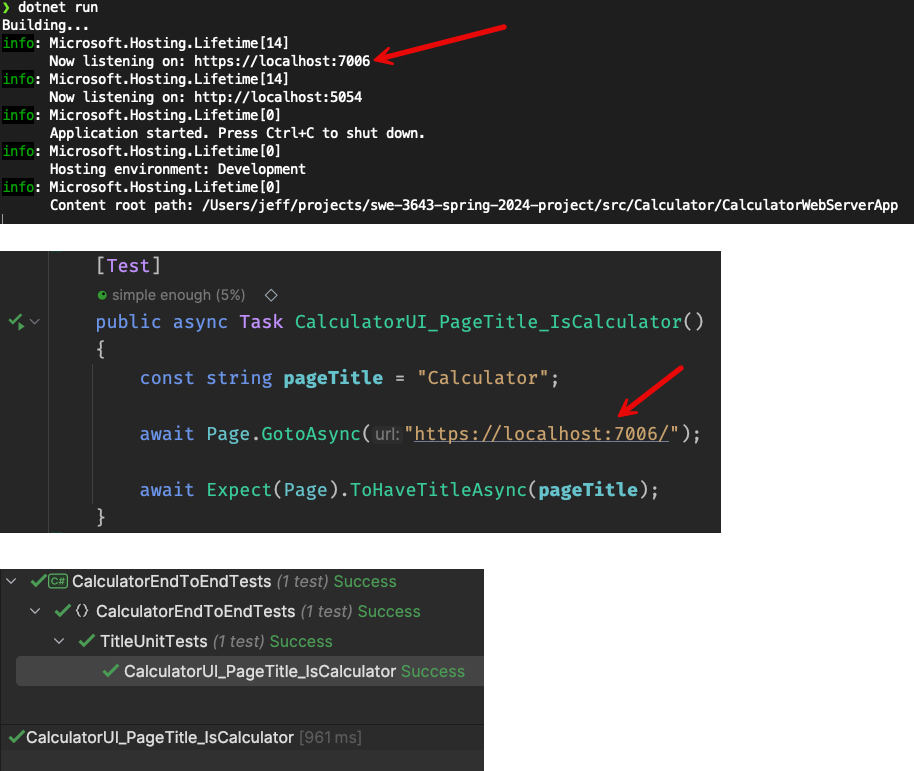
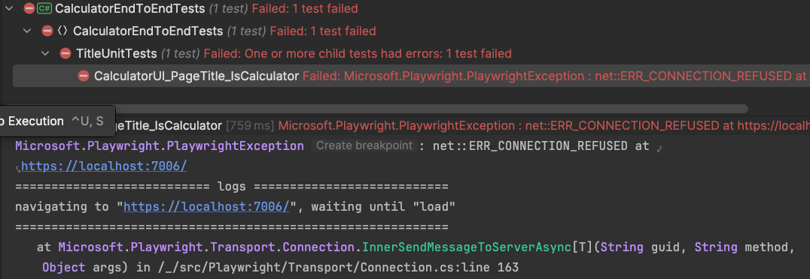
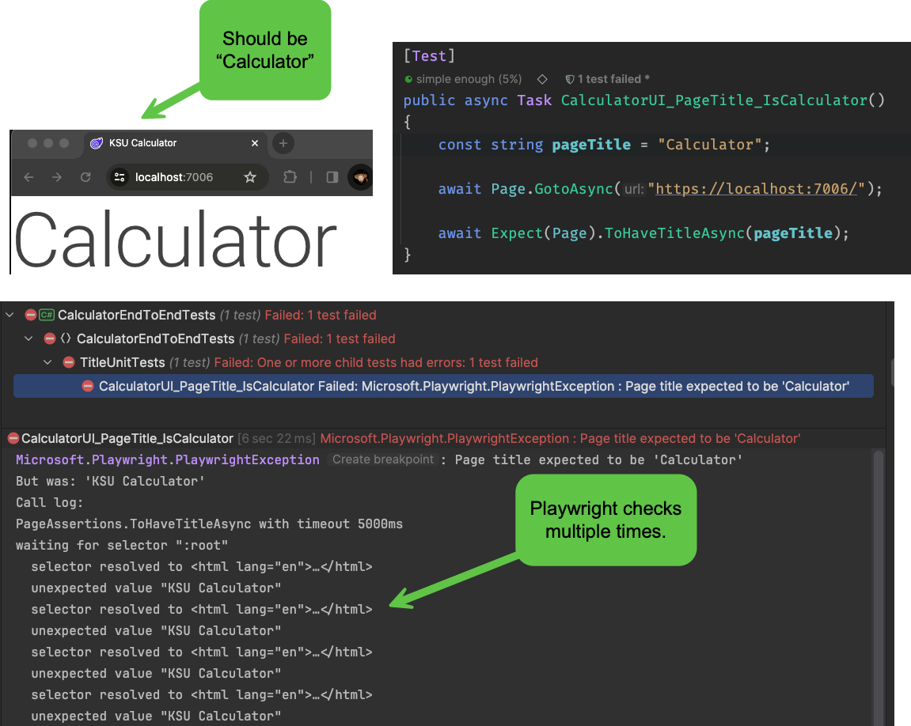
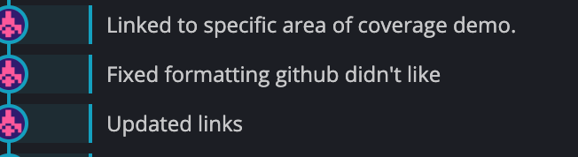

#### KSU SWE 3643:<br/>Software Testing and Quality Assurance<br/>Semester Project

[**Back to Project Overview**](README.md)

# Software Requirements Specification

#### Table of Contents

-  [Using This Document](#using-this-document)
-  [Coding Standards Requirements](#coding-standards-requirements)
-  [Development Environment Requirements](#development-environment-requirements)
-  [Source Control Requirements](#source-control-requirements)
-  [Documentation Requirements](#documentation-requirements)
-  [Project Architecture Requirements](#project-architecture-requirements)
-  [Package Management Requirements](#package-management-requirements)
-  [Application Structure Requirements](#application-structure-requirements)
-  [Calculator Logic Requirements](#calculator-logic-requirements)
-  [Web Application Requirements](#web-application-requirements)
-  [Visual Design Requirements](#visual-design-requirements) 
-  [Unit Test Plan and Coverage Requirements](#unit-test-plan-and-coverage-requirements)
-  [End-To-End Test Plan and Requirements](#end-to-end-test-plan-and-requirements)
-  [Final Presentation Requirements](#final-presentation-requirements)
-  [Suggested Implementation Order](#suggested-implementation-order)

## Using This Document

All requirements in this document follow this naming convention:

​	`preq-NAME-#`

If a requirement is language-specific, it will be suffixed by the language name. For example:

​	`preq-NAME-#.C#`

Before submitting your semester project, search for all `preq-` lines in this document and verify you have met every requirement.

The `preq` prefix means "Project Requirement". It is simple convention to help you find all of the requirements.

## Coding Standards Requirements

Coding standards vary by language. It is a common mistake to apply naming conventions, capitalization, and organization standards from one language to another. For example, the following shows the different naming conventions followed by C#, Java, and Python for method naming:

-  C#<br>`public string MakeFullName(string firstName, string lastName)`<br>*Method names following the **SentenceCase** naming convention.*
-  Java<br>`public String makeFullName(String firstName, String lastName)`<br>*Method names follow the **pascalCase** naming convention.*
-  Python<br>`def make_full_name(first_name, last_name):`<br>*Method names follow the **snake_case** naming convention.*

Avoid this mistake by becoming conversant in the coding standards followed by each language. These conventions are published by the language's creator. Following these standards demonstrates your expertise with the language and makes it easier for you to understand code written by others that follows correct conventions.

**preq-CODING-STANDARDS-1.C#**

Your C# code will follow the language's published coding standards.

-  https://learn.microsoft.com/en-us/dotnet/csharp/fundamentals/coding-style/coding-conventions
-  https://learn.microsoft.com/en-us/dotnet/csharp/fundamentals/coding-style/identifier-names
-  https://www.dofactory.com/csharp-coding-standards

**preq-CODING-STANDARDS-1.Java**

Your Java code will follow the language's published coding standards.

-  https://google.github.io/styleguide/javaguide.html
-  https://www.oracle.com/technetwork/java/codeconventions-150003.pdf

**preq-CODING-STANDARDS-1.Python**

Your Python code will follow the language's published coding standards.

-  https://peps.python.org/pep-0008/
-  https://google.github.io/styleguide/pyguide.html

## Development Environment Requirements

**preq-DEV-ENV-1**

You will use the JetBrains IDE related to your language of choice. [JetBrains offers an outstanding education license to students with an active `.edu` email address.](https://www.jetbrains.com/community/education/#students) If you do not have a JetBrains education license, sign up for one immediately. 

All of the JetBrains IDEs are cross-platform.

**preq-DEV-ENV-1.C#**

[You will use JetBrains Rider for C# development.](https://www.jetbrains.com/rider/download)

**preq-DEV-ENV-1.Java**

[You will use JetBrains Intellij for Java development.](https://www.jetbrains.com/idea/download)

**preq-DEV-ENV-1.Python**

[You will use JetBrains PyCharm for Python development.](https://www.jetbrains.com/pycharm/download/)

**preq-DEV-ENV-2**

After installing your JetBrains IDE and activating your education license, open Settings | Plugins and spend some time looking at the various plugins available in the Marketplace.

Plugins enhance your development experience by extending the IDE's capabilities. 

Plugins are generally specific to the language you are using, so look around and see what interests you. 

Some of the plugins I like for C# development include:

-  Cyclomatic Complexity<br>Shows the complexity of a method.
-  Cognitive Complexity<br>A more advanced form of Cyclomatic Complexity that also considers how difficult your code will be to read.
-  Heap Allocations Viewer<br>Shows when a line of code is going to allocate an object on the heap. Allocations on the heap increase pressure on the garbage collector.

**preq-DEV-ENV-3**

[Install the **Test Automation** plugin in your JetBrains IDE. This might assist with your Playwright testing requirements.](https://www.jetbrains.com/help/aqua/ui-test-automation.html#test_automation_features)

## Source Control Requirements

**preq-SOURCE-1**

You will check all source code, documentation, unit tests, and end-to-end tests in a public git repository hosted by GitHub.com. This is called your *Team Repository* in this document.

**preq-SOURCE-2**

You will place a `README.md` file in the root folder of your Team Repository. This file will be written using the industry-standard [Markdown](https://www.markdownguide.org/getting-started/) markup language.

**preq-SOURCE-3**

Your Team Repository will implement the following folder structure:

-  **REPOSITORY ROOT**<br>`README.md` and files associated with your documentation, such as screenshots, videos, etc.
   -  **src**<br>All source code and tests will be located under `/src` following the specific requirements in the [Application Structure](#application-structure) section.

**preq-SOURCE-4**

Your Team Repository will add a `.gitignore` file to the root of the repository. 

**preq-SOURCE-4.C#**

[Use this `.gitignore` file for Rider and C# development.](https://github.com/JetBrains/resharper-rider-samples/blob/master/.gitignore) Extend the file as necessary to ignore additional file types not needed in your source repository.

**preq-SOURCE-4.Java**

[Use this `.gitignore` file for IntelliJ and Java development.](https://github.com/github/gitignore/blob/main/Global/JetBrains.gitignore) Extend the file as necessary to ignore additional file types not needed in your source repository.

**preq-SOURCE-4.Python**

[Use this `.gitignore` file for PyCharm and Python development.](https://gist.github.com/rask004/4c322384aa6012d6c5a7178071d3c8fb) Extend the file as necessary to ignore additional file types not needed in your source repository.

#### Managing Your `git` Repo

You have several options for managing your `git` repository:

-  [Work from the command line.](https://www.geeksforgeeks.org/using-git-on-commandline/)
-  [Use GitHub Desktop.](https://desktop.github.com/)
- [Use GitKraken.](https://www.gitkraken.com/) 

  *This is my preferred tool. The full version requires a license. The free version works fine for most student projects.*
-  [Use your JetBrains IDE's Git Tool Window.](https://www.jetbrains.com/guide/java/tutorials/creating-a-project-from-github/the-git-tool-window/)

## Documentation Requirements

**preq-DOCUMENTATION-1**

Your project will contain a README.md file written using Markdown in the root of your Team Repository.

When you visit the root directory of a GitHub repository, GitHub automatically displays the README.md file. It makes it much easier for a consumer of your project to find and understand what is contained in the repository.

[This is an essential document, so its content and structure must be polished and complete.](https://dev.to/yuridevat/how-to-create-a-good-readmemd-file-4pa2)

**preq-DOCUMENTATION-2**

Your project's README.md file will contain the following sections:

-  Introduction
-  Table of Contents
-  Team Members
-  Architecture
-  Environment
-  Executing the Web Application
-  Executing Unit Tests
-  Reviewing Unit Test Coverage
-  Executing End-To-End Tests
-  Final Video Presentation

Order your README.md file according to the section order shown above.

**preq-DOCUMENTATION-3**: Introduction

Your Introduction section will be titled "KSU SWE 3643 Software Testing and Quality Assurance Semester Project: Web-Based Calculator" rather than "Introduction". Set this section to an H1 (\# KSU SWE...).

Following the title, write a short (2-3 sentence) description of what the repository contains.

**preq-DOCUMENTATION-4**: Table of Contents

Create an H2 section named *Table of Contents* (#\# Table of... ). List the sections starting with Environment as bullets.

List all of the sections in your document execept the introduction and Table of Contents. Create a hyperlink to each section. Your hyperlink will look like the following example:

```text
## Table of Contents

- [Environment](#environment)
- [Executing the Web Application](#executing-the-web-application)
```

All of your links will be [*relative*](https://github.blog/2013-01-31-relative-links-in-markup-files/). If you find yourself writing links that include GitHub's address, you are likely not writing relative links. Clone this repository if you need an example: the relationship of README.md to requirements.md demonstrates relative linking.

To create an [anchor link (a link that jumps somewhere within the current document)](https://github.blog/2013-01-31-relative-links-in-markup-files/), prefix the section's title with a # symbol, then write the title lowercase and place a dash in place of all spaces. Always test your anchor links after checking your work into GitHub to verify that they work correctly (particularly if you use Typora, which is more forgiving than GitHub).

**preq-DOCUMENTATION-5**: Team Members

List your team members. You do not need to include any contact information (your repository is public).

**preq-DOCUMENTATION-6**: Architecture

Briefly describe the architecture of your project. [Reference the architecture diagram from this document. Make the diagram an image - not a link.](#project-architecture-requirements) 

You are encouraged to update the architecture diagram to better match your project structure. The original diagram is generic and may not properly describe your specific implementation. [The original diagram uses PlantUML.](https://www.plantuml.com/plantuml/uml/VL9DQzj04BthLmp99IQnstCf9R9II0fnJAsabq9Oxqxa9QDTiHzMGyb_hwQAy1fRteFNmxptTkOzNViWN8WrPOB8jhN-eqsLPOsGhw92E2i4oKWYM0VVJQKDmlAZzGaMeaRV8V4CpabNcx2cYDdV3BeZINWFE_O7kM_okOHSgOiNiYA0DaqC-HKarNpILmd-8MpGbQrzQD09e-unRApo5xFPR98bi9KsUx8ZGXsi8ZocnQ3tB7i_wSAZqG5AzC73LWlumVKLBFeBWvmDdhmX-ygkZ7Z2b5weD-Vo0F7SEULpOTJy-IU6w8nVnVfYCeQ-qLkjy3_Xyq1Os90lOhr6npnU3quCCfr-E-YE6l8Brx12jqK7UTCSVWhzrlTM8VbT_QInJSh2ck0i4JhFewKrJpF03nk3RjePMM0qK3KjxRIxaZoN9DvQnulivmZ7SrIbvPyanRrW7k-I26-qRpfrNrZdK8OdGH4vb8Ga0Z5fFyc1bqPvzAc2j7pr1Q5mNVmUWxyp0TsBaBWB7qRdP-zIBx_0RLak6KvipMy3joWKeVSmTxRrwDXPIJOgE4zSscY58BMJXBrd2G66V_3rn7EiUur6nPh-0G00) You can use any diagramming tool you like (so long as the results look professional), but give PlantUML a try.

```html
@startuml
allowmixing

package "Calculator Logic Module" #lightblue
{
    class DescriptiveStatistics {
        + ValidationFunctions
        + LogicFunctions
    }

    class LinearRegression {
        + ValidationFunctions
        + LogicFunctions
    }

}

package "Calculator Logic Unit Tests via JUnit, NUnit, or Pytest" #lightyellow
{
  class LogicUnitTests {
    + DescriptiveStatistics_AcceptsValueMeanStdDev_ReturnsZScore()
    + LinearRegression_EmptyList_ReturnsError()
  }

  LogicUnitTests --> DescriptiveStatistics
  LogicUnitTests --> LinearRegression

}

package "Calculator Web Server App" #lightblue
{
   class Models
   class Views
   class Controllers

   Controllers --> Views
   Controllers --> Models
   Controllers --> DescriptiveStatistics
   Controllers --> LinearRegression
}

package "Calculator End-To-End Tests via Playwright" #lightyellow {
  class CalculatorEndToEndTests {
     + CalculatorUI_ListofValues_CalculatesMean()
     + CalcuatlorUI_EmptyListOfValues_DisplaysError()
     + CalculatorUI_InvalidListOfValues_DisplaysError()
  }

    CalculatorEndToEndTests --> Controllers : HTTP Call via\n Headless Browser
}

cloud #yellow {
  hide circle
  class Browser
  Browser <--> Controllers : HTTP Call
}
@enduml
```

**preq-DOCUMENTATION-7**: Environment

Explain how to configure the environment to execute your web application, unit tests, and end-to-end tests. For example:

```html
This is a cross-platform application and should work in Windows 10+, Mac OSx Ventura+, and Linux environments. Note that the application has only been carefully tested in Windows 11.

To prepare your environment to execute this application:
 1. [Install the latest Java runtime for your system.](https://www.java.com/en/download/manual.jsp)
 2. ...

To configure Playwright for end-to-end testing:
  1. ...
```

If you are writing something that *should* be cross-platform, but you have only tested on a single platform (such as Windows or Linux), note where you have tested it specifically.

If your environment setup includes terminal commands, use single primes for inline commands (such as `git` ) or triple primes for blocks:

```bash
This is a code block.
It can contain multiple lines.
```

**preq-DOCUMENTATION-8**: Executing the Web Application

Create an H2 section called *Executing the Web Application*. 

Describe the detailed steps to build and execute your web application *from the command line (terminal / console)*. Your user may not have an IDE installed. 

Your last step will describe how to connect to the running web application from a browser on the same machine. This often requires a port. For example, `6. After the application starts, launch a browser and connect to http://localhost:60012`.

Include sample output from building and executing the web application. For example:

```bash
$ dotnet run
info: Extensions.Hosting.AsyncInitialization.RootInitializer[0]
      Starting async initialization
info: Microsoft.Hosting.Lifetime[14]
      Now listening on: https://localhost:60012
```

If you find certain errors popping up when you run the application (such as port in use), note these common problems and how to fix them. You want your user to have little or no trouble getting your application running. For example:

-  If you see the following error, something is already running on the application's HTTP port. Free up the port, then try again:<br>`Unhandled IO exception: Failed to bind to https://127.0.0.1:60012: address already in use.`
   

**preq-DOCUMENTATION-9**: Executing Unit Tests

Create an H2 section called *Executing Unit Tests*. 

Describe the detailed steps to build and execute all of your unit tests *from the command line (terminal / console)*. Your user may not have an IDE installed.

Finally, include sample output in a code block. For example:

```bash
$ dotnet test

Starting test execution, please wait...
A total of 1 test files matched the specified pattern.
Starting test execution, please wait...
A total of 1 test files matched the specified pattern.

Passed!  - Failed:     0, Passed:   132, Skipped:     0, Total:   132, Duration: 39 ms - HighMatch.Compass.UnitTest.Extensions.dll (net7.0)
```

**preq-DOCUMENTATION-11**: Reviewing Unit Test Coverage

Create an H2 section called *Reviewing Unit Test Coverage*.

Note the coverage achieved in your Calculator Logic module and include a screenshot of your coverage graphic from your JetBrains IDE. Your calculator logic must achieve 100% test coverage of all statements and paths.

Coverage statistics look similar to the following example:



**preq-DOCUMENTATION-12**: Executing End-To-End Tests

Create an H2 section called *Executing End-To-End Tests*. 

Describe the detailed steps to build and execute all of your end-to-end unit tests *from the command line (terminal / console)*. Your user may not have an IDE installed.

Finally, include sample output in a code block. For example:

```bash
# From /Users/jeff/projects/swe-3643-spring-2024-project/src/Calculator/CalculatorEndToEndTests

❯ dotnet test
  Determining projects to restore...
  All projects are up-to-date for restore.
  CalculatorEndToEndTests -> /Users/jeff/projects/swe-3643-spring-2024-project/src/Calculator/CalculatorEndToEndTests/bin/Debug/net8.0/CalculatorEndToEndTests.dll
Test run for /Users/jeff/projects/swe-3643-spring-2024-project/src/Calculator/CalculatorEndToEndTests/bin/Debug/net8.0/CalculatorEndToEndTests.dll (.NETCoreApp,Version=v8.0)
Microsoft (R) Test Execution Command Line Tool Version 17.8.0 (arm64)
Copyright (c) Microsoft Corporation.  All rights reserved.

Starting test execution, please wait...
A total of 1 test files matched the specified pattern.

Passed!  - Failed:     0, Passed:     1, Skipped:     0, Total:     1, Duration: 2 s - CalculatorEndToEndTests.dll (net8.0)
```

**preq-DOCUMENTATION-13**: Final Video Presentation

Create an H2 section called *Final Video Presentation*. 

Include a link to your final video presentation. If the file is checked into your Team Repository, this will be a relative link. Otherwise, it will be a fully-qualified link to YouTube or Vimeo. For example:

**[Please view our project's presentation here on YouTube](https://www.youtube.com/watch?v=dQw4w9WgXcQ).**

## Project Architecture Requirements

Your application will separate calculation logic from web logic. This will simplify unit testing, help your code achieve the [single responsibility principle](https://en.wikipedia.org/wiki/Single-responsibility_principle), and decouple the logic mechanisms from the user interface. The following high-level component layout shows the modules you will implement and their relationship to one another.


You must carefully organize your code to achieve this architecture. In particular, you *cannot* [closely couple the calculator logic with the user interface logic](https://uxdesign.cc/separating-business-and-ui-logic-the-proper-way-a58a64529333). For example, if you perform a calculation in the Calculator Web Server App's controllers, models, or views, you are doing it wrong. The controller class in the Calculator Web Server App requests calculations from the Calculator Logic classes.

**preq-TECHNICAL-DESIGN-1**

The **Calculator Logic** module accepts values from the web server, performs the calculation logic, and returns floating-point values. This module does not perform any user interface functions.

**preq-TECHNICAL-DESIGN-2**

The **Calculator Web Server App** module references the **Calculator Logic** module. The **Calculator Web Server App** generally follows the [MVC pattern](https://www.geeksforgeeks.org/mvc-framework-introduction/) to generate the user interface (Views), calls the Calculator Logic (via the Controller), and returns results to the user's browser (by combining a Model into a View for transformation into HTML):


**preq-TECHNICAL-DESIGN-3**

The **Calculator Logic Unit Tests** only reference the **Calculator Logic** module. Your unit tests *will not not test this project's Calculator Web Server App*. You will use NUnit (C#), JUnit (Java), or `pytest` (Python) to write your unit tests.

**preq-TECHNICAL-DESIGN-4**

The **Calculator End-to-End Tests** connect to your **Calculator Web Server App** and test the user interface end-to-end (which includes calling the Calculator Logic via the web server's controller). You will use [Playwright](https://playwright.dev/) to write your end-to-end (also called e2e) tests.

## Package Management Requirements

[Package managers simplify sharing code.](https://developer.mozilla.org/en-US/docs/Learn/Tools_and_testing/Understanding_client-side_tools/Package_management) Almost all languages implement one or more package management tools.

**preq-PACKAGES-1.C#**

You will use the Nuget package manager to install the NUnit and Playwright testing frameworks, plus any other dependencies your C# web application requires.

-  Nuget and `.csproj`<br>https://www.jetbrains.com/help/rider/Using_NuGet.html
   -  Nuget packages you will reference include (but are not limited to) NUnit and Playwright.

**preq-PACKAGES-1.Java**

You will use the Maven package manager to install the JUnit and Playwright testing frameworks, plus any other dependencies your Java web application requires.

-  Maven and `POM.xml`<br>https://www.jetbrains.com/help/idea/maven-support.html
   -  Maven packages you will reference include (but are not limited to) JUnit and Playwright.

**preq-PACKAGES-1.Python**

You will use the PIP package manager to install the `pytest` and Playwright testing frameworks, plus any other dependencies your Python web application requires.

-  Python: PIP plus a `requirements.txt` file in the root of your `src` directory.<br>Installing your Python packages will occur in a Terminal with this command:<br>`$/src/$ pip install -r requirements.txt`<br>[See here for more information](https://note.nkmk.me/en/python-pip-install-requirements/ )
   -  PIP packages you will reference include (but are not limited to) `pytest` and `pytest-playwright`.

## Application Structure Requirements

**preq-APPLICATION-STRUCTURE-1**

You will choose one of the following languages, server architectures, and test runners:

-  C# / .NET Core 8 or newer (do not choose .NET Framework)
   -  ASP.NET Blazor Server + NUnit + Playwright 
      *Use Interactive Server Mode, not WASM or static SSR*
   -  ASP.NET MVC + NUnit + Playwright
-  Java / Version 21 or newer
   -  Spring Boot  + JUnit + Playwright
      *Use Maven 3.5+, Spring Initializer, and the instructions at https://spring.io/guides/gs/spring-boot*
-  Python / Version 3.14 or newer
   -  Flask + Pytest + Playwright

**preq-APPLICATION-STRUCTURE-2**

You will use the latest version of your language of choice:

-  [C# - .NET 8](https://dotnet.microsoft.com/en-us/download/dotnet/8.0)
-  [Java - Java JDK 21](https://www.oracle.com/java/technologies/downloads/#java21)
-  [Python - Python 3.12 or higher](https://www.python.org/downloads/)

*Do not use an antique version of your language. If you already have the language installed, verify that the version is up-to-date. When you start new projects, you (generally) do not want to be on an old version.*

**IMPORTANT: These are the language versions my machine will have installed when I test your projects.**

**preq-APPLICATION-STRUCTURE-3.C#** 

Your C# project will follow this application structure:

-  **REPOSITORY ROOT**<br>Your `README.md` file is here.
   -  **src**<br>Name your solution `Calculator.sln` and place it in the `src` folder.
      -  **CalculatorWebServerApp** project<br>This is your web server application. It will reference the **CalculatorEngine.csproj** project.
      -  **CalculatorEngine** project<br>This is the calculator logic project. It does not contain any user interface logic. It is referenced by your `CalculatorWebServerApp.csproj` web server app project.
      -  **CalculatorEngineUnitTests** project <br>This is your NUnit unit test project. It references your **CalculatorEngine.csproj** project. All clear box unit tests to achieve 100% coverage of **CalculatorEngine** will be in this project.
      -  **CalculatorEndToEndTests** project<br>This is your Playwright test project. It references the NUnit and Playwright Nuget packages. All end-to-end tests will be in this project. This project will use Playwright and a headless browser to test your web interface.

**preq-APPLICATION-STRUCTURE-3.Java**

Your Java project will follow this application structure using [Maven and `pom.xml` for references and package management](https://stackoverflow.com/a/11241131):

-  **REPOSITORY ROOT**<br>Your `README.md` file is here.

   -  **src**<br>Place your root Maven `pom.xml` file here. Each subfolder will also need a `pom.xml` file.

      -  **web**<br>Your calculator web server app goes here. It references the `calculator-logic` module.
         -  **src**
            -  **main**
               -  **java**
               -  **resources**
               -  **webapp**
                  -  **WEB-INF**
                     -  [web.xml](https://cloud.google.com/appengine/docs/legacy/standard/java/config/webxml)
      -  **calculator-logic**<br>Your calculator logic goes here. It does not contain any user interface logic. It is referenced by your web server module.
         -  **src**
            -  **main**
               -  **java**
      -  **tests**<br>This is your JUnit unit test package. It references the `calculator-logic` module. All clear box unit tests to achieve 100% coverage of `calculator-logic` will be in this  module.
         -  **src**
            -  **main**
               -  **java**
      -  **e2e**<br>This is your Playwright test module. It references the JUnit and Playwright Maven packages. All end-to-end tests will be in this package. This module will use Playwright and a headless browser to test your web interface.
         -  **src**
            -  **main**
               -  **java**

**preq-APPLICATION-STRUCTURE-3.Python**

Your Python project will follow thiCas application structure:

-  **REPOSITORY ROOT**<br>Your `README.md` file is here.
   -  **src**<br>Place your `requirements.txt` file in `src` to install your application dependencies, such as Flask, pytest, and Playwright.
      -  **web**<br>Contains your Flask web server app. [Follow the Flask conventions for structuring this directory](https://flask.palletsprojects.com/en/2.3.x/tutorial/layout/).
      -  **calcuator_engine**<br>
         -  `__init__.py`
         -  This folder contains your calculator logic. It does not contain any user interface logic. It is referenced by your web app.
      -  **tests**<br>This folder will use `pytest` and reference `calculator-logic` to reach 100% clear box unit test coverage.
         -  `__init__.py`
         -  `pytest` unit test files
      -  **e2e**<br>This folder will use Playwright and a headless browser to test your web interface.
         -  `__init__.py`
         -  Playwright test files. 
   
   *[What is the significance of`__init__.py` in a Python project?](https://www.python-engineer.com/posts/init-py-file/)*

## Calculator Logic Requirements

**preq-LOGIC-1**

All calculator logic will be in its own folder, module, or namespace. See [Application Architecture Requirements](#application-architecture-requirements) for specific instructions how to structure your overall project. The calculator logic module will not contain *any* user interface logic.

**preq-LOGIC-2**

All operations will use floating point math - *not integers*. Input A, Input B, and the calculation result will be floating point values. In C# and Java, use the `double` type.

To simplify requirements tracability (and grading), please include the requirement # as a comment in the first line of the method.

For example:

```html
public CalculationResult ComputeMean(List<double> values) {
	//preq-LOGIC-3
...
```

Following are the mathematical operations you must implement and the UI button (in the web server view) that executes the operation:

| Requirement                                                  | UI Button                                                    | Inputs                                                       | Returns                                                      | Example                                                      |
| ------------------------------------------------------------ | ------------------------------------------------------------ | ------------------------------------------------------------ | ------------------------------------------------------------ | ------------------------------------------------------------ |
| **preq-LOGIC-3**<br />Compute sample standard deviation      | **Compute Sample Standard Deviation  \| one value per line** | List of **one** or more numeric values, one value per line<br /><br />Ignore empty lines and spaces<br /><br /><br />Error when:<br />- any line contains a non-numeric value (such as "123X" or "123,124")<br />- there is not a single valid numeric value | Sample standard deviation of values in list                  | 9<br/><br/>6<br/><br/>8<br/><br/>5<br/><br/>7<br /><br />Returns<br />1.5811388300841898 |
| **preq-LOGIC-4**<br />Compute population standard deviation from a list of values | ****Compute Population Standard Deviation  \| one value per line** | List of **two or more** numeric values, one value per line<br /><br />Ignore empty lines and spaces<br /><br /><br />Error when:<br />- any line contains a non-numeric value (such as "123X" or "123,124")<br />- there are fewer than two valid numeric values | Population standard deviation of values in list              | 9<br/><br/>6<br/><br/>8<br/><br/>5<br/><br/>7<br /><br />Returns<br />1.4142135623731 |
| **preq-LOGIC-5**<br />Compute mean (average) from a list of values | ****Compute Mean  \| one value per line**                    | List of **one or more** numeric values, one value per line<br /><br />Ignore empty lines and spaces<br /><br /><br />Error when:<br />- any line contains a non-numeric value (such as "123X" or "123,124")<br />- there is not a single valid numeric value | Mean (average) of values in list                             | 9<br/><br/>6<br/><br/>8<br/><br/>5<br/><br/>7<br /><br />Returns<br />35 |
| **preq-LOGIC-6**<br />Compute a z-score from a value, mean, and standard deviation | ****Compute Z Score  \| value, mean, stdDev on one line**    | **Three and only three numeric values** separated by commas on a single line<br /><br />Error when:<br /><br />- the first line does not contain three and only three numeric values separated by commas (ignore spaces)<br /><br />- there is more than one line of values<br />- the standard deviation value is zero (division by zero) | Z-score for a value (1st value) using the mean (2nd value) and standard deviation (3rd value) | 11.5,7,1.5811388300841898<br <br /><br />Returns<br />2.846049894151541 |
| **preq-LOGIC-7**<br />Compute a single variable linear regression formula from a list of X,Y pairs | **Compute Single Linear Regression Formula  \| one x,y pair per line** | List of **one or more** X,Y comma-separated number pairs (one X,Y pair per line).<br /><br />Ignore empty lines and spaces<br /><br />Error when:<br />- any line does not contain exactly two valid numeric values separated by a comma (ignore spaces)<br />- there is not a single X,Y pair | Regression formula in the form y = mx + b                    | 1.47,52.21<br/><br/>1.5,53.12<br/><br/>1.52,54.48<br/><br/>1.55,55.84<br/><br/>1.57,57.2<br/><br/>1.6,58.57<br/><br/>1.63,59.93<br/><br/>1.65,61.29<br/><br/>1.68,63.11<br/><br/>1.7,64.47<br/><br/>1.73,66.28<br/><br/>1.75,68.1<br/><br/>1.78,69.92<br/><br/>1.8,72.19<br/><br/>1.83,74.46,<br /><br />Returns<br />y = 61.272186542107434x + -39.061955918838656 |
| **preq-LOGIC-8**<br />Predict a Y value using the X, M (slope), and B (intercept) values of a single variable regression formula | **Predict Y from Linear Regression Formula  \| x, m, b on one line** | **Three and only three** numeric values separated by commas on a single line<br /><br />Error when:<br /><br />- the first line does not contain three and only three numeric values separated by commas (ignore spaces)<br /><br />- there is more than one line of values | Prediction for y value when x (first value) is multiplied by m (slope, second value) and added to the intercept (b, third value) | 1.535,61.272186542107434, -39.061955918838656<br /><br />Returns<br />y = 54.990850423296244 |

#### Notes

1.  Implementing these functions will is not complex simple (this is not a math class). Use your language's built-in math library for operations such as computing the square root of the variance:

    -  [C# System.Math](https://learn.microsoft.com/en-us/dotnet/api/system.math?view=net-8.0)

    -  [java.lang.Math](https://docs.oracle.com/javase/8/docs/api/java/lang/Math.html)

    -  [Python math](https://docs.python.org/3/library/math.html)
2.  Review the [Suggested Implementation Order](#suggested-implementation-order) section before implementing all of your math methods. It contains some suggested approaches for structuring how you return the results of a math operation, plus writing unit tests alongside your math methods using the [Test Driven Development methodology](https://testdriven.io/test-driven-development/).
3.  Detecting division by zero and other calculation errors is language-specific. For example, C# and Java return `double.Infinity` when division by zero occurs while Python throws an exception. Carefully research how to detect and handle these conditions.

## Web Application Requirements

**preq-WEB-APPLICATION-1**

Your web application will implement the Visual Design demonstrated by [this UI mockup](https://app.moqups.com/MvLts3wDDVQ8TNQBIdQN5nOCilbNhjYo/view/page/ac244bb80?ui=0). Follow the layout, color, and style conventions demonstrated by the UI mockup. Do not add any additional functions or UI elements.

I recommend using a friendly [CSS framework for layout](https://getbootstrap.com/docs/5.3/layout/grid/) such as [Bootstrap](https://www.w3schools.com/bootstrap/bootstrap_forms.asp) to help create your user interface, but that is your decision. If you do not use a CSS grid, your layout will need to use [HTML tables](https://www.w3schools.com/html/html_tables.asp).

**preq-WEB-APPLICATION-2**

Your web application's user interface will provide a button and call to every logic operation in the [Calculator Logic](#calculator-logic-requirements) project/module. Your web application will handle both valid and error responses from the calculator logic. 

**preq-WEB-APPLICATION-3**

When your web application starts, it will show the following default values. This is called the Start/Default State:

-  The result box does not indicate an error condition and says, "Enter a value(s) below and select an operation."
-  Input A and Input B contain `0`.

**preq-WEB-APPLICATION-4**

When the user clicks the Clear button, it will return the interface to the Start/Default state.



**preq-WEB-APPLICATION-5**

Your web application will detect and handle invalid (non-numeric ) input (Error State). Input errors will display "Invalid Input, Numbers Only" to the user. See the [UI mockup](https://app.moqups.com/MvLts3wDDVQ8TNQBIdQN5nOCilbNhjYo/view/page/ac244bb80?ui=0) for the expected response to invalid input. For example, if the user puts `25` into Input A and `five` into Input B, the result will look like the following:

```html
Invalid Input, Numbers Only
```

**preq-WEB-APPLICATION-6**

Your web application will detect and handle numeric input that creates an error condition such as division by zero (Error State). Numeric errors will display `Not a Number` to the user. See the [UI mockup](https://app.moqups.com/MvLts3wDDVQ8TNQBIdQN5nOCilbNhjYo/view/page/ac244bb80?ui=0) for the expected response to numeric error conditions. For example, if the user puts `25` into Input A and `0` into Input B, the result will look like the following:

```html
25 / 0 =
Not a Number
```

The first line shows the operation that led to the numeric error followed by `=`.

The second line states `Not a Number`.

**preq-WEB-APPLICATION-7**

Your web application will display the operation and result on two lines.  See the [UI mockup](https://app.moqups.com/MvLts3wDDVQ8TNQBIdQN5nOCilbNhjYo/view/page/ac244bb80?ui=0) for the expected response. For example, if the user puts `123.55` into  Input A and `-15.9` into Input B and clicks `A * B`, the result will look like the following:

```html
123.55 * -15.9 =
-1,964.445
```

The first line shows the operation followed by `=`.

The second line shows the result of the operation.

**preq-WEB-APPLICATION-8**

I recommend using a friendly [CSS framework for layout](https://getbootstrap.com/docs/5.3/layout/grid/) such as [Bootstrap](https://www.w3schools.com/bootstrap/bootstrap_forms.asp), but that is your decision. At a minimum, your layout will need to use [HTML tables](https://www.w3schools.com/html/html_tables.asp).

## Visual Design Requirements

**preq-VISUAL-DESIGN-1**

Your web application will implement the Visual Design demonstrated by [this UI mockup](https://app.moqups.com/MvLts3wDDVQ8TNQBIdQN5nOCilbNhjYo/view/page/ac244bb80?ui=0). Follow the layout, color, and style conventions demonstrated by the UI mockup. Do not add any additional functions or UI elements.

**preq-VISUAL-DESIGN-2**

Set the result box to the following colors when there is an error (Error State

-  Background: #B70F0A
-  Foreground (text): #FFFFFF


**preq-VISUAL-DESIGN-3**

Set the result box to the following colors when the application starts, there is a valid result, or the user clicks the Clear button (Start/Default State)

-  Background: #FFECD7
-  Foreground (text): #000000



**preq-VISUAL-DESIGN-4**

Set all buttons to the following colors:

-  Background: #EBEBEB
-  Foreground (text): #000000



**preq-VISUAL-DESIGN-5**

Set the operation's table header to the following colors:

-  Background: #EBEBEB
-  Foreground (text): #000000


**preq-VISUAL-DESIGN-5**

Make the "Calculator" an H1 HTML tag.


**preq-VISUAL-DESIGN-6**

[Set the browser's page title/tab name to "Calculator".](https://www.w3schools.com/html/html_head.asp)



## Unit Test Plan and Coverage Requirements

**preq-UNIT-TEST-1**

All unit tests will be in their own folder, module, or namespace. See [Application Architecture Requirements](#application-architecture-requirements) for specific instructions how to structure your overall project.

**preq-UNIT-TEST-2**

You will use one of the following unit testing frameworks, depending on your language of choice:

-  [C# - NUnit](https://nunit.org/)
-  [Java - JUnit](https://junit.org/junit5/)
-  [Python - `pytest`](https://docs.pytest.org/en/8.0.x/)

#### Unit Test List

You will implement the following unit tests of your calculator logic to reach 100% statement *and* path coverage (that is why there are multiple tests for some operations).

To simplify requirements tracability (and grading), please include the requirement # above the the `arrange` section as a comment of each unit test.

For example:

```html
//preq-UNIT-TEST-2

//arrange
...
```

Following are the minimum unit tests you must include:

| Requirement #     | Operation                      | Button   | Inputs            | Returns                                               | Example                                                      |
| ----------------- | ------------------------------ | -------- | ----------------- | ----------------------------------------------------- | ------------------------------------------------------------ |
| preq-UNIT-TEST-2  | Add                            | A + B    | A, B              | A plus B                                              | 5.5 + -3.15 = 2.35                                           |
| preq-UNIT-TEST-3  | Subtraction                    | A - B    | A, B              | A minus B                                             | 27.93 - 4 = 23.93                                            |
| preq-UNIT-TEST-4  | Multiplication                 | A * B    | A, B              | A times B                                             | 5 * 7.1 = 35.5                                               |
| preq-UNIT-TEST-5  | Division                       | A / B    | A, B              | A divided by B                                        | 3.0 / 9.0 = .33333333                                        |
| preq-UNIT-TEST-6  | Division ERROR                 | A / B    | A, B              | Error                                                 | 3.0 / 0.0 = error                                            |
| preq-UNIT-TEST-7  | Equals                         | A == B   | A, B              | 1 when equivalent to 8 precision points. 0 otherwise. | 0.333333== 0.333333 = 1,<br />0.33333333== 0.33333334 = 0,<br />0.333333331== 0.333333332 = 1 |
| preq-UNIT-TEST-8  | Raise to Power                 | A ^ B    | A, B              | A raised to the power of B                            | 2 ^ 3 = 8, <br />5 ^ 2 = 25,<br />5 ^ -3 = 0.008             |
| preq-UNIT-TEST-9  | Logarithm of number            | A log B  | A, B              | Exponent of logarithm A at base B                     | 8 log 2 = 3,<br />25 log 5 = 2                               |
| preq-UNIT-TEST-10 | Logarithm of number ERROR 1    | A log B  | A, B where A <= 0 | Error                                                 | 0 log 2 = error,<br />-2 log 2 = error                       |
| preq-UNIT-TEST-11 | Logarithm of number ERROR 2    | A log B  | A, B where B = 0  | Exponent of logarithm A at base B                     | 8 log 0 = error                                              |
| preq-UNIT-TEST-12 | Root of number                 | A root B | A, B              | Bth root of A                                         | 8 root 3 = 2,<br />25 root 2 = 5                             |
| preq-UNIT-TEST-13 | Root of number ERROR           | A root B | A, B where B = 0  | Bth root of A                                         | 8 root 0 = error                                             |
| preq-UNIT-TEST-14 | Factorial of number            | A !      | A                 | A * (A-1) * (A - ...) * 2 * 1                         | 5 = 120,<br />-5 = -120<br />0 = 1                           |
| preq-UNIT-TEST-15 | Factorial of number CONVENTION | A !      | A                 | A * (A-1) * (A - ...) * 2 * 1                         | 0 = 1<br>By convention, 0 returns 1.                         |
| preq-UNIT-TEST-16 | Sine of A                      | sin A    | A                 | sin(A)                                                | 360 = 0<br />-360 = 0<br />0 = 0,<br />1 = 0.0174524         |
| preq-UNIT-TEST-17 | Cosine of A                    | cos A    | A                 | cos(A)                                                | 360 = 1<br /><br />-360 = 1<br />1= 0.99985                  |
| preq-UNIT-TEST-18 | Tangent of A                   | tan A    | A                 |                                                       | 360 = 0<br />-360 = 0<br />1=0.0174551                       |
| preq-UNIT-TEST-19 | Reciprocal of A                | 1 / A    | A                 | 1 divided by A                                        | 1 / 8 = 0.125<br />1 / -4 = -0.25                            |
| preq-UNIT-TEST-20 | Reciprocal of A ERROR          | 1 / A    | A                 | 1 divided by A where A = 0                            | 1/ 0 = ERRROR                                                |

#### 100% Unit Test Coverage of CalculatorEngine

**preq-UNIT-TEST-21**

Your CalculatorEngine module must have 100% unit test coverage of all methods and paths.

You can calculate coverage statistics in Intellij, Rider, or Pycharm.

Coverage statistics look similar to the following example:


Anywhere you see something in your CalculatorEngine with less than 100% coverage, write a unit test.

#### Unit Test Naming Conventions and Structure

**preq-UNIT-TEST-22**

You will name all unit tests following this pattern:

`MethodName_StateUnderTest_ExpectedBehavior`

-  Method Name = The name of the method being tested. For example, `Add`.
-  State Under Test = The state of the method you are testing. For example, `TwoFloatingPointValues`.
-  Expected Behavior = What you expect to happen. For example, `ReturnsSumOfValues`.

The best naming conventions express a requirement. This is one of many that are used by the industry.

Here are some more examples:

-  `Division_FloatingPointValueAndZero_ReturnsError`
-  `Reciprocal_Zero_ReturnsError`

**preq-UNIT-TEST-23**

You will structure your unit tests using the industry-standard [Arrange-Act-Assert (AAA) pattern](https://medium.com/@pjbgf/title-testing-code-ocd-and-the-aaa-pattern-df453975ab80).

-  Arrange<br>Setup the criteria, instances, mocks, etc. necessary for your test.
-  Act<br>Invoke the method being tested.
-  Assert<br>Check whether your expectations met the actual output of the method under test.

For example:

```C#
[Test]
public void Add_TwoFloatingPointValues_ReturnsSum()
{
    // Arrange
    const double a = 1.5;
    const double b = 2.75;
    const double expected = 4.25;

    // Act
    var result = CalculatorEngine.Add(a, b);

    // Assert
    Assert.Equal(expected, result, 8); //where 8 = points of precision
}
```

## End-To-End Test Plan and Requirements

**preq-E2E-TEST-1**

All end-to-end Playwright tests will be in their own folder, module, or namespace. See [Application Architecture Requirements](#application-architecture-requirements) for specific instructions how to structure your overall project.

**preq-E2E-TEST-2**

You do *not* need to compute coverage for your end-to-end Playwright tests.

**preq-E2E-TEST-3**

You will use one of the following unit testing frameworks, depending on your language of choice:

-  [C# : NUnit + Playwright](https://playwright.dev/dotnet/docs/intro)
-  [Java : JUnit + Playwright](https://playwright.dev/java/docs/intro)
-  [Python : `pytest` + Playwright](https://playwright.dev/python/docs/intro)

**preq-E2E-TEST-4**

Install Playwright according to the instructions for your language and operating system.

-  [C# : NUnit + Playwright](https://playwright.dev/dotnet/docs/intro)
-  [Java : JUnit + Playwright](https://playwright.dev/java/docs/intro)
-  [Python : `pytest` + Playwright](https://playwright.dev/python/docs/intro)

If you forget this step, you will see output similar to the following:

```bash
Microsoft.Playwright.PlaywrightException : Executable doesn't exist at /Users/jeff/Library/Caches/ms-playwright/chromium-1028/chrome-mac/Chromium.app/Contents/MacOS/Chromium
╔════════════════════════════════════════════════════════════╗
║ Looks like Playwright was just installed or updated.       ║
║ Please run the following command to download new browsers: ║
║                                                            ║
║     pwsh bin/Debug/netX/playwright.ps1 install             ║
║                                                            ║
║ <3 Playwright Team                                         ║
╚════════════════════════════════════════════════════════════╝

```

#### End-To-End Test List

You will implement the following end-to-end tests of your calculator user interface via the Playwright testing framework.

To simplify requirements tracability (and grading), please include the requirement # as as a comment in the first line of each end-to-end test.

For example:

```html
//preq-E2E-TEST-5
... playwright code follows
```

Following are the minimum end-to-end tests you must include:

| Requirement #    | Test                                                         |
| ---------------- | ------------------------------------------------------------ |
| preq-E2E-TEST-5  | Verify the page title is "Calculator".                       |
| preq-E2E-TEST-6  | From the application's default state, compute the sample standard deviation for 9, 2, 5, 4, 12, 7, 8, 11, 9, 3, 7, 4, 12, 5, 4, 10, 9, 6, 9, 4. Verify that the result is 3.060787652326. |
| preq-E2E-TEST-7  | From the application's default state, attempt to compute the population standard deviation with an empty list. Verify the error message is shown. |
| preq-E2E-TEST-8  | From the application's default state, attempt to compute the sample standard standard deviation with a single value. Verify the error message is shown. |
| preq-E2E-TEST-9  | From the application's default state, compute the mean for 9, 2, 5, 4, 12, 7, 8, 11, 9, 3, 7, 4, 12, 5, 4, 10, 9, 6, 9, 4. Verify that the result is 7. |
| preq-E2E-TEST-10 | From the application's default state, compute the z-score for 5.5 with a mean of 7 and a standard deviation of 3.060787652326. Verify that the result is -0.49007. |
| preq-E2E-TEST-11 | From the application's default state, compute the single linear regression formula for the following 12 X,Y pairs. Verify the result is y = -0.04596X + 6.9336.<br />5,3<br/>3,2<br/>2,15<br/>1,12.3<br/>7.5,-3<br/>4,5<br/>3,17<br/>4,3<br/>6.42,4<br/>34,5<br/>12,17<br/>3,-1 |
| preq-E2E-TEST-12 | From the application's default state, predict the Y value for the regression values X=6, M=-0.04596, B=6.9336. Verify the result is 6.65784. |

#### End to End Test Naming Conventions and Structure

**preq-E2E-TEST-13**

You will name all end-to-end tests following this pattern:

`MethodName_StateUnderTest_ExpectedBehavior`

-  Method Name = The name of the method being tested. For example, `CalculatorUi`.
-  State Under Test = The state of the method you are testing. For example, `AddTwoFloatingPointValues`.
-  Expected Behavior = What you expect to happen. For example, `ReturnsSumOfValues`.

The best naming conventions express a requirement. This is one of many that are used by the industry.

Here are some more examples:

-  `CalculatorWebUi_DivideFloatingPointValueAndZero_ReturnsNotANumberError`
-  `CalculatorWebUi_TextInInputBox_ReturnsInvalidInputError`

**preq-E2E-TEST-14**

Your end-to-end tests do not have to strictly follow the AAA pattern like your unit tests because end-to-end testing is often a linear set of steps, and every step or two is doing an assertion. Try to organize your end-to-end tests to be as readable.

For example:

```C#
[Test]
public void CalculatorWebUi_PageTitle_IsCalculator()
{
    const string pageTitle = "Calculator";

    await Page.GotoAsync("http://localhost:5054/");
        
    await Expect(Page).ToHaveTitleAsync(pageTitle);
}
```

#### End to End Test Notes

1.  In a professional environment, we would build test fixtures that automatically start and stop the web server before and after the test. You do not need to do that (though I encourage you to do so if you can, simply for the practice). You can start the web server in your IDE or terminal, then run your tests using the address your web server is running. For example:<br>

    

2.  Your Playwright tests will fail if your web server app is not running. You will see an error similar to the following:<br>
3.  Failing tests show you what was expected and what the application returned.<br>

## Final Presentation Requirements

**preq-PRESENTATION-1**

Watch at least one short tutorial how to make good programming videos. For example:

-  https://realpython.com/how-to-make-programming-videos/

**pre-PRESENTATION-2**

Present the material in your presentation following the Section # order that prefixes each presentation requirement.

**preq-PRESENTATION-3** Section 1, Repository overview and structure

Briefly review your GitHub team repository including the structure/where everything is located.

**preq-PRESENTATION-4** Section 2, Web app demo

Execute your web server application from the command line/terminal (not from your IDE), then switch to a web browser and demonstrate the following:

-  A double-operand operation.
-  A single-operand operation.
-  A double-operand operation that creates a **Not a Number** condition.
-  A single-operand operation that creates a **Not a Number** condition.
-  Any operation that creates an **Invalid Input** condition.
-  Resetting the UI to the default state after an operation by clicking Clear.

**preq-PRESENTATION-5** Section 3, Execute unit tests

Switch to your command line/terminal and execute your unit tests (not from your IDE). All unit tests should succeed. 

**preq-PRESENTATION-6** Section 4, Unit test structure

Switch to your IDE and briefly discuss the structure of two unit tests:

-  A unit test that tests checks for a valid condition, such as a successful Add operation.
-  A unit test that checks for an error condition, such as division by zero.

**preq-PRESENTATION-7** Section 5, 100% unit test coverage

Switch to your IDE and demonstrate generating code coverage statistics for your CalculatorEngine project. Your coverage should be 100%. It will look similar to the following example:


**preq-PRESENTATION-8** Section 6, Execute end-to-end tests

Switch to your command line/terminal and execute your end-to-end tests  (not from your IDE). All end-to-end tests should succeed. 

**preq-PRESENTATION-9** Section 7, End-to-end test structure

Switch to your IDE and briefly discuss the structure of two end-to-end tests:

-  An end-to-end test verifying the page title is "Calculator"
-  An end-to-end test testing for an error condion, such as division by zero.

**preq-PRESENTATION-10**

Keep your recorded presentation to 5-to-8 minutes in length.

**preq-PRESENTATION-11**

Check your video into your GitHub repository (you will likely have to compress it) or host it on YouTube or Vimeo (one of these usually works best for most students since GitHub does not allow giant video files). Link to the video in your README.md file.

## Suggested Implementation Order

I suggest implementing your semester project in this order to achieve the highest score.

1. Create your Calculator Logic module and the Mean method.

2. Create your unit test module and implement the unit tests for Mean. This will help you structure how to return both valid conditions and error conditions. Instead of just returning a floating point result, you should return an object with multiple properties, such as:

   ```c#
   //C#
   
   public class CalculationResult {
     public double Result { get; set;} = 0.0;
     public bool IsSuccess { get; set; }
     public string Operation { get; set; } // for example, "1.25 + 3.8 ="
     public string Error { get; set; } // for example, "" or "Not A Number"
   }
   ```

   ```java
   //Java
   
   public class CalculationResult {
       private double result = 0.0;
       private boolean isSuccess;
       private String operation; 
       private String error; 
   
       public double getResult() {
           return result;
       }
   
       public void setResult(double result) {
           this.result = result;
       }
   
       public boolean getIsSuccess() {
           return isSuccess;
       }
   
       public void setIsSuccess(boolean isSuccess) {
           this.isSuccess = isSuccess;
       }
   
       public String getOperation() {
           return operation;
       }
   
       // for example, "1.25 + 3.8 ="
       public void setOperation(String operation) {
           this.operation = operation;
       }
   
       public String getError() {
           return error;
       }
      
       // for example, "" or "Not A Number"
       public void setError(String error) {
           this.error = error;
       }
   }
   ```

   ```python
   # Python
   
   class CalculationResult:
       def __init__(self):
           self.result = 0.0
           self.is_success = False
           self.operation = "" # for example, "1.25 + 3.8 ="
           self.error = "" # for example, "" or "Not A Number"
   ```

3. Next, complete all Logic methods and unit tests.<br>*Consider trying the [Test Driven Development (TDD) testing methodology](https://testdriven.io/test-driven-development/) here. TDD advocates writing your test method before the code it actually tests. This leads to very testable code, tests that express requirements, and tests that document how to call the methods in your project.*

4. Create your web server app and reference the Logic module.

5. Create a basic controller, model, and view that renders a multiline input box (text area), a button, and an output area. Hook the input box and button to the Logic module's Mean method and get the input/output showing in the web browser.

6. Now that you are able to call the Logic module from your web app, implement the entire web interface.

7. Once your web application is fully operational, write your end-to-end Playwright tests.

8. Update all of your README.md documentation to match your environment, command-line execution statements, etc.

9. Search this document for every `preq-` requirement. Validate that you met every requirement. If you missed a requirement, implement it.

10. Record your final video presentation. Check the link into your README.md file.

11. Clone your GitHub team repository to an entirely new directory on your computer (or better, a fresh computer such as a friend's machine). Follow the steps to configure the environment and execute the web app and tests. Does everything work? Is anything missing? If not, then you are done. If something was missing, then figure out what was not checked into your repository or you did not document properly in your README.md, then try it again. Repeat until your project is easy to clone and execute with minimal effort.

12. Open a browser and visit your GitHub repository. Navigate to your README.md file and verify it is appropriately formatted. Look for Markdown that is improperly formatted. Click every link in the README.md file. Do they all work? Did you break an anchor link? Did GitHub interpret your Markdown a little differently than Typora or VS Code suggested it would look? These are common issues that must be corrected to ensure your work is highly polished. If you find an issue, correct the file on your machine, then check in the fix and validate again. You can see this activity in my own GitHub check-in history:

13. Each team member should review your GitHub submission if you are in a Team of Two. Make sure you both agree that the project is ready. In a prior semester, a team of four was upset that their team grade was lower than expected because the team member who handled the submission could have done a better job. Never let a teammate's lack of motivation or capability impact your success, even if that means you must do more work than you consider fair.

## Errors and/or Inconsistencies in these Documents

I have made this document as complete, consistent, accurate, and as approachable as time permitted.

If there is an error, or you suspect there is an error, let me know, and I will correct the problem. I am *not* trying to trick you or confuse you. Large technical documents are difficult to keep perfectly correct and internally consistent,

Thank you for your help in this matter.